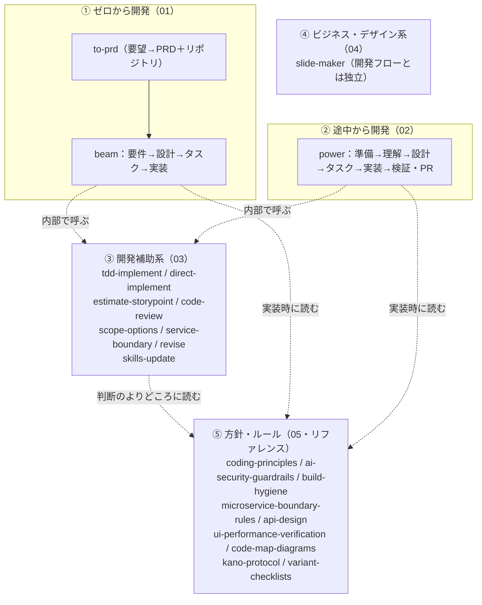

# スキルカタログ 目次

このフォルダは、開発・資料作成に使う**スキル一式（全25スキル）と、それらが参照する基準・ルール（9リファレンス）**の説明書です。初見の人が「何があって・どれを・どう使うか」を掴めるよう、用途別に5グループへ分けています。

## まず結論：目的別の入口

| やりたいこと | 読むファイル |
|---|---|
| **新しいプロダクトをゼロから作りたい** | [01 ゼロから開発](01-ゼロから開発スキル.md)（to-prd → beam） |
| **既存システムに機能を追加／リファクタしたい** | [02 途中から開発](02-途中から開発スキル.md)（power） |
| 上記の中で使われる部品を知りたい | [03 開発補助系](03-開発補助系スキル.md) |
| プレゼン資料・スライドを作りたい | [04 ビジネス・デザイン系](04-ビジネス・デザイン系スキル.md)（slide-maker） |
| スキルが「何を基準に判断しているか」を知りたい | [05 方針・ルール](05-方針・ルール.md)（リファレンス文書） |

## 5グループの構成

| # | グループ | 収録 | 概要 |
|---|---|---|---|
| 01 | [ゼロから開発](01-ゼロから開発スキル.md) | 8スキル | 曖昧な要望 → PRD → 要件定義 → 設計 → タスク分解 → 実装。`to-prd` と `beam` シリーズ |
| 02 | [途中から開発](02-途中から開発スキル.md) | 8スキル | 既存システムへの機能追加・リファクタ。準備 → 理解 → 設計 → 実装 → 検証・PR。`power` シリーズ |
| 03 | [開発補助系](03-開発補助系スキル.md) | 8スキル | 01・02 の両方から呼ばれる共有エンジンと横断ツール（実装・見積もり・レビュー・スコープ・境界判定・改定・スキル更新） |
| 04 | [ビジネス・デザイン系](04-ビジネス・デザイン系スキル.md) | 1スキル | 開発ワークフロー外。PowerPoint 資料の段階作成（`slide-maker`） |
| 05 | [方針・ルール](05-方針・ルール.md) | 9リファレンス | スキルではなく、スキルが実行時に読む基準・ルール（コード品質・セキュリティ・ビルド/デプロイ・境界判定・API 設計・UI/性能検証・図示と根拠・Kano・チェックリスト） |

**合計: 25スキル ＋ 9リファレンス**

## 全体像

要点: **開発は「ゼロから（beam）」と「途中から（power）」の2本柱**。どちらも実装・見積もり・レビューなどの**補助スキル（03）を内部で呼び**、それらは**基準・ルール（05）を判断のよりどころに読む**。スライド作成（04）はこの体系とは独立したツール。

## 読む順のおすすめ

1. **この目次（00）** で全体像をつかむ
2. 目的に応じて **01 か 02** を通読（先頭にフロー説明と Mermaid 図あり）
3. 途中で出てくる部品が気になったら **03** を参照（01・02 では重複を避け「（開発補助系スキル参照）」と記載）
4. 「なぜそう判断するのか」を深掘りしたくなったら **05**

## 補足

- 各スキルは Claude Code 上で `/スキル名`（例: `/to-prd`、`/power`）で起動します。ただし多くの補助スキルは**ワークフローから自動で呼ばれる**ため、人間が直接叩く必要はありません（各ファイルの「使用法」に明記）。
- スキルの実体は `~/.claude/skills/` にあり、テンプレートリポジトリ経由で新規プロジェクトにも同梱されます。このカタログは**その説明書**であり、スキル本体とは別に管理しています。
- **テンプレートリポジトリの場所は `.claude/skills/template.conf` の1か所だけで決まります**（スキル本文には個人名・組織名を書いていません）。社内などへ展開するときは、展開先テンプレートのこのファイルだけを書き換えます。新規リポジトリの作成先とクローン先は、実行する人の GitHub アカウントとホームディレクトリから自動で決まります。
