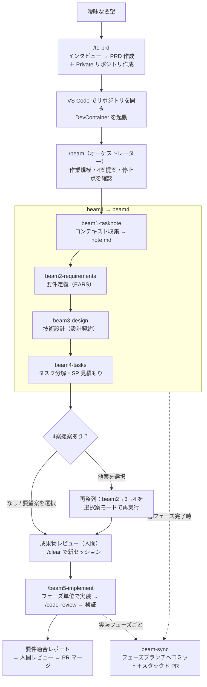

# ゼロから開発スキル（8個）

「なんとなくこういうものを作りたい」という**曖昧な要望から、新規プロダクトの実装完了まで**を段階的に進めるワークフロー群。入口の **to-prd**（要望→PRD＋リポジトリ作成）と、**beam シリーズ**（要件定義→設計→タスク分解→実装＋Git 連携）で構成される。各工程の成果物はすべてファイルとして残り、次の工程の入力になる。

## 前提用語（初見の方向け）

| 用語 | 意味 |
|---|---|
| PRD | プロダクト要求定義書（Product Requirements Document）。何を作るかを構造化した文書で、このワークフロー全体の起点 |
| EARS | 要件定義の記法（Easy Approach to Requirements Syntax）。「〜のとき、システムは〜すること」の形で曖昧さを排除する |
| DevContainer | VS Code の開発コンテナ。リポジトリに同梱された設定で、誰のPCでも同じ開発環境が立ち上がる |
| `{要件名}` | プロジェクト名（＝リポジトリ名）。成果物の保存先フォルダ名になる（例: `docs/spec/task-bridge/`） |
| TASK-XXXX | タスク分解フェーズが発行する実装タスクの ID（例: TASK-0003） |
| tasks.db | タスクの状態（ready / in_progress / done 等）を管理する SQLite データベース。ダッシュボードで可視化できる |
| SP（ストーリーポイント） | 工数（時間）ではなく、タスクの相対的な規模・複雑さを表す見積もり値 |
| 信頼性レベル | 成果物の各項目に付くラベル。🔵 確実 ／ 🟡 妥当な推測 ／ 🔴 推測 |
| トランク | 取り込み先の本流ブランチ（通常 `main`）。beam は**トランク1本だけ**で運用し、常設の統合ブランチ（`develop`）は作らない |
| スタックド PR | フェーズごとの Pull Request を「前のフェーズのブランチを土台に」積み上げる方式（GitHub ネイティブ機能）。マージ順が強制され、`gh stack merge` で**まとめてアトミックに**トランクへ落とせる |
| power | 既存システムに機能を追加する姉妹ワークフロー（→「02-途中から開発スキル」参照） |

## 一連のフロー

1. **`/to-prd`** — 曖昧な要望をインタビュー（1回1問）で具体化し、**PRD を生成**。同時にテンプレートから **Private リポジトリを新規作成**して PRD をコミット・プッシュする。
2. **リポジトリを開く** — クローン先を VS Code で開き、DevContainer を起動する（テンプレート由来なので設定・スキル一式が同梱済み）。
3. **`/beam`** — オーケストレーターが「作業規模」「スコープ4案提案の要否」「停止点」を確認し、**beam1 → beam2 → beam3 → beam4** を順に実行する。
   - 途中で開発補助系スキルが自動で組み込まれる: beam2/beam4 → `scope-options`、beam3 → `service-boundary`、beam4 → `estimate-storypoint`（いずれも開発補助系スキル参照）
   - 各フェーズの完了時に **beam-sync** が、そのフェーズ専用ブランチへのコミットとスタックド PR を自動作成する（前フェーズのブランチの上に積まれる）
4. **4案提案を有効にした場合** — beam4 の見積もり後に SP 比較表が出て「どの案で実装するか」を選択。要望案以外を選ぶと beam2→3→4 が選択案モードで**再実行**され、要件・設計・タスクが選択案に揃う。
5. **成果物レビュー → 実装** — 人間が要件・設計・タスクを確認したら、**`/clear`（新しいセッション）にしてから** `/beam5-implement` を実行。実装は tdd-implement / direct-implement（開発補助系スキル参照）に委譲され、**各実装フェーズは PR 化の前に `/code-review` でゲート**される（CRITICAL/HIGH がゼロになるまで修正）。最後に実環境での動作確認と**要件適合ゲート**を通る。
6. **仕上げ** — 各フェーズの `/code-review`（開発補助系スキル参照）は beam5 内で適用済み。人間が最終レビューして PR をマージする。完成後に仕様変更が出たら `/revise`（開発補助系スキル参照）。

---

## to-prd

### 目的
「家計簿アプリを作りたい」レベルの**曖昧な要望を、開発に使える PRD に具体化する入口**。経験豊富なプロダクトマネージャーとして 1回に1つずつ質問し（専門用語を避ける・非機能要件は必ず数値化）、10項目（ビジョン／ユーザー／機能／成功指標／ビジネス要件／ユーザーストーリー／受け入れ条件／機能要件／非機能要件／**スコープ外**）を埋める。仕上げに GitHub の**テンプレートから Private リポジトリを新規作成**し、PRD をコミット・プッシュするところまで自動化する。

### 使用法
- `/to-prd` を実行（「PRD を作りたい」「新しいプロジェクトを立ち上げたい」でも起動）
- 質問に1つずつ答える → 要件名（＝リポジトリ名・ケバブケース）の提案を確認 → 内容の最終確認 → リポジトリ作成を承認
- 前提: GitHub CLI（`gh`）が `repo` スコープで認証済みであること

### 生成物
- **GitHub Private リポジトリ** `{あなたのアカウント}/{要件名}`（テンプレート由来＝DevContainer 設定・スキル一式・ダッシュボードが同梱済み。元になるテンプレートは `template.conf` で決まる）。クローン先: `~/{要件名}`（WSL のホームディレクトリ）
- `docs/spec/{要件名}/product-requirements.md` — 構造化 PRD（US-*・AC-*（Given-When-Then 形式）・FR-*・NFR-*（数値必須）の ID 付き・優先度 MoSCoW 付き・スコープ外明記）

---

## beam（オーケストレーター）

### 目的
beam1〜beam4 を**選んだ停止点まで一括実行する司令塔**。最初に「作業規模（フル機能開発／軽量開発／カスタム）」「スコープ4案提案の要否」「停止点（要件定義まで／設計まで／タスク分解まで）」を確認し、あとは各フェーズを順に呼び出して成果サマリーを集約する。実装（beam5）は重いフェーズのため対象外——成果物を人間がレビューしてから別途実行する設計。

### 使用法
- PRD のあるリポジトリ内（DevContainer 推奨）で `/beam`
- 3つの質問（規模・4案提案・停止点）に答えるだけで停止点まで自動進行。フェーズがエラーで止まったら「再試行／次へ進む／中止」を確認される
- 4案提案を有効にした場合、beam4 の後に案の選択と（必要なら）再整列ループまで面倒を見る

### 生成物
- 自身の生成物はなし（各フェーズの成果物を集約した完了サマリーと、次のアクション案内を表示）

---

## beam1-tasknote

### 目的
開発を始める前の**コンテキスト収集**。PRD・CLAUDE.md・README・既存の実装や設計文書・Git の状態を読み集め、「このプロジェクトはどんな技術で・どんなルールで・何がすでにあるのか」を1本のノートに整理する。後続の要件定義・設計フェーズが毎回同じ情報を探し直さなくて済むようにする共通入力。

### 使用法
- 通常は **/beam から自動実行**される
- 単独実行: `/beam1-tasknote [作業規模]`。既存の note.md があれば「そのまま使う／再生成する」を確認される
- フル機能開発では既存実装の詳細探索（サブエージェント）も行う

### 生成物
- `docs/spec/{要件名}/note.md` — プロジェクト概要・技術スタック・開発ルール・関連実装・技術的制約・注意事項・Git 情報・収集ファイル一覧
- beam-sync によるフェーズブランチへのコミット＋スタックド PR

---

## beam2-requirements

### 目的
PRD とノートを基に、**EARS 記法の要件定義書**を作る。既存情報から埋まる部分は埋め、不明点だけを段階的にヒアリング（差分ヒアリング）。全項目に信頼性レベルを付け、確定できなかった技術判断は「**未解決事項（beam3 で決定）**」表に集約して先送りを可視化する。ユーザーが事前に用意すべきもの（API キー・アカウント等）は prep.md に抽出し、実装側でダミー値を埋め込む事故を防ぐ。性能系の NFR は数値必須だが根拠のない数字を置かないよう、Core Web Vitals や API のパーセンタイルといった**相場**（05 の `ui-performance-verification.md` §1）を出どころにし、対象ユーザーに合わせて調整した理由を添えて書く。

### 使用法
- 通常は **/beam から自動実行**される。スコープ4案提案が有効なら、要件定義の後に scope-options の define（機能×4案マトリクス作成。開発補助系スキル参照）もここで走る
- 単独実行: `/beam2-requirements [作業規模] [scope-options=on|off]`
- 4案提案で要望案以外が選ばれた後の再実行では**選択案モード**で動作（既存要件の流用＋追加機能のみ差分ヒアリング）

### 生成物
- `docs/spec/{要件名}/` 配下: `requirements.md`（REQ-*/NFR-*/EDGE-*）・`user-stories.md`（US-*）・`acceptance-criteria.md`（AC-*）・`interview-record.md`（ヒアリング記録）・`prep.md`（ユーザー準備タスク。該当時のみ）・`scope-options.md`（4案提案 ON 時のみ）
- beam-sync によるフェーズブランチへのコミット＋スタックド PR

---

## beam3-design

### 目的
要件を**技術設計**に落とす。アーキテクチャ・データフロー・型定義・DB スキーマ・API 仕様という「**設計契約**」（実装が従うべき取り決め）を確定し、beam2 が先送りした未解決事項をここで1件ずつ決着させる。サービス分割の要否は service-boundary（開発補助系スキル参照）で判定。**API 仕様を書くときは `api-design.md`（05 参照）を基準にする**——URL 命名・ステータスコード・エラー形式・ページネーション方式を毎回ゼロから決めずに済む。外部のデータベースやファイルを読む設計では、推測ではなく**実物のスキーマを確認して契約に固定**する（「テスト全通過なのに動かない」事故の予防）。技術選定の結果に応じて prep.md も同期する。

### 使用法
- 通常は **/beam から自動実行**される
- 単独実行: `/beam3-design [作業規模]`。ヒアリングは未解決事項の決着を最優先に行われる
- 再整列時は**選択案モード**（スコープ非依存の確定判断は引き継ぎ、文書は選択案で再生成）

### 生成物
- `docs/spec/{要件名}/design/` 配下: `architecture.md`・`dataflow.md`・`design-interview.md`（常時）、`interfaces.ts`・`database-schema.sql`・`api-endpoints.md`（フル機能開発時）
- `prep.md` の更新（追加🆕／変更✏️／不要化❌の差分同期）
- beam-sync によるフェーズブランチへのコミット＋スタックド PR

---

## beam4-tasks

### 目的
設計を**実装タスクに分解**する。各タスクに実装方式（TDD＝コーディング系／DIRECT＝環境構築系）・依存関係・SP（estimate-storypoint による見積もり。開発補助系スキル参照）を付け、1フェーズ 30SP 以内の実行単位に整理する。**要件カバレッジゲート**——「対応タスクの無い要件」が1件でも残ると先に進めない照合——により、要件の取りこぼしを構造的に防ぐのが最大の特徴。全タスクは tasks.db にも登録され、ダッシュボードで進捗を可視化できる。

### 使用法
- 通常は **/beam から自動実行**される。スコープ4案提案が有効なら、正式見積もりの後に scope-options の estimate（4案の SP 比較→案の選択。開発補助系スキル参照）が走る
- 単独実行: `/beam4-tasks [作業規模] [scope-options=on|off]`
- 再整列時は**選択案モード**（旧タスクを破棄して選択案から再分解・tasks.db は作り直し）

### 生成物
- `docs/tasks/{要件名}/` 配下: `TASK-*.md`（タスクごとの実装詳細・テスト要件・完了条件）・`overview.md`（フェーズ構成・依存関係・**要件カバレッジ行列**）
- `data/tasks.db` — タスク管理 DB（SP・状態・依存を保持）
- beam-sync によるフェーズブランチへのコミット＋スタックド PR

---

## beam5-implement

### 目的
分解済みタスクを**実装する司令塔（ディスパッチャ）**。自分ではコードを大量に書かず、フェーズ単位でサブエージェントを起動し、各タスクの実装は tdd-implement / direct-implement（開発補助系スキル参照）に委譲する。フェーズ間の知識は code-map.md（実装の現状インデックス）で引き継ぎ、コンテキストの肥大化を防ぐ。**各実装フェーズは、beam-sync が PR 化する前に `/code-review` でゲート**する（power6 と同型の CRITICAL/HIGH=0・最大2周のループ。残る LOW/MEDIUM は既知・許容として記録）。ゲートで直した不具合には**再発防止テストを1本添える**（AI は同じ種類のミスを繰り返すため）。最後に統合チェック（build・全テスト・型・Lint）に加えて、**実データ・実環境での動作確認**（テスト全通過≠動く）と**要件適合ゲート**（全要件を根拠付きで⭕／❌判定。❌が残れば完了と認めない）を通す。実環境確認の中身は `ui-performance-verification.md` §2（05 参照）に従い、スモーク → 主要ジャーニー → レスポンシブ → **アクセシビリティ（WCAG AA・キーボード完走）** → 性能実測の順で確かめる。

### 使用法
- beam4 完了後、成果物を人間がレビューしてから、**`/clear`（新しいセッション）にして** `/beam5-implement` を実行（会話履歴は不要——すべてファイルから読み直すため）
- 範囲指定が可能: 引数なし（残り全フェーズ）／`TASK-0003`（1タスクのみ）／`Phase 2`（1フェーズのみ）
- 実行前に「仕様・設計だけが新しい」状態（ドリフト）を検知すると `/revise`（開発補助系スキル参照）の実行を促す

### 生成物
- `src/` 等の実装コードとテスト一式
- `docs/implements/{要件名}/{TASK-ID}/` — タスクごとの実装記録
- `docs/tasks/{要件名}/code-map.md` — 実装の現状インデックス（責務・公開シンボル・規約）
- `docs/tasks/{要件名}/conformance-report.md` — 要件適合レポート（要件 ID × 判定 × 根拠）
- `docs/reviews/` — 各実装フェーズの `/code-review` レポート
- tasks.db の status 更新、実装フェーズごとの PR（beam-sync）

---

## beam-sync

### 目的
beam / power / revise が共有する **Git 連携担当**（**名前は beam- だが beam 専用ではない**——スタック機構（ブランチ確保・`gh stack link`・cascade rebase 追従）を二重に持つと必ずドリフトするため、3者で1本に集約している。power から呼ぶときの差分は「フェーズ名」と「要約に読むファイル」だけで、機構は同一）。各フェーズを**そのフェーズ専用のブランチ**（前フェーズのブランチから分岐）にコミットし、GitHub ネイティブの**スタックド PR** として積み上げる。前フェーズの成果はブランチの祖先として含まれるため、**作業ツリーは常に完全**で、複数フェーズが同じファイルを触っても衝突しない。ブランチ運用は**トランクベース**——常設の `develop` は持たず、ファイルのコピーもしない（すべて本物の親子関係を持つコミット）。何度呼んでも安全（冪等）で、`.env` などのシークレットは .gitignore と直前チェックの**二重ガードで絶対にコミットしない**。

### 使用法
- 通常は **各フェーズの完了時に自動で呼ばれる**（人間が直接呼ぶ必要はない）。呼び出し元は beam だけではなく、**beam1〜beam5** に加えて **power ワークフローの `power1-4` / `power5-phaseN` / `power6`**（→「02-途中から開発スキル」参照。power は **own モードのみ**。`power1-4` だけブランチ名が例外で `feature/{機能名}`）、および **`/revise`（phase: `revise-{slug}`）** からも呼ばれる
- 単独実行: `/beam-sync {要件名 or 機能名} {phase}`（例: `beam-sync task-bridge beam3` / `beam-sync wordbook-v2 power5-phase1`）
- 前提: `gh` 認証と git の user.name/email 設定（DevContainer 内でも必要）。未設定なら案内を出してスキップし、フェーズ自体は止めない
- 前提: `gh-stack` 拡張（`gh extension install github/gh-stack`）。DevContainer では自動導入され、無い場合は中断して案内する（手動でのスタック運用にはフォールバックしない）
- マージは **`gh stack merge`** を使う。下から上への順序・base の張り替え・ブランチ削除は **GitHub 側が面倒を見る**ため人手で管理しない。**スカッシュは使わない**（フェーズごとの履歴を残すため）
- **ドキュメントのフェーズ（beam1〜4）は都度マージしてよい**が、**コードのフェーズ（beam5）は全実装フェーズの検証が済むまでスタックに保持**し、最後にまとめてマージする——こうするとトランクが「機能が半分だけ入った状態」を経由せず、**常にリリース可能**に保たれる

### 生成物
- フェーズ別ブランチ（`beam2-{要件名}` 等）へのコミット（前フェーズのブランチの上に積まれる）
- トランクへのスタックド PR（概要・フェーズ要約・変更一覧を生成ファイルから自動作成した説明文付き）
