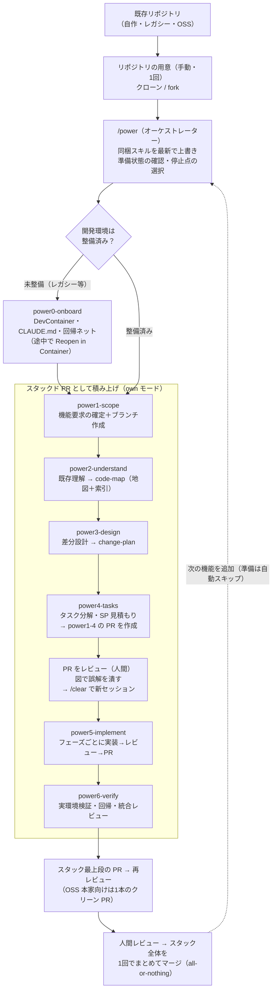

# 途中から開発スキル（8個）

**すでに存在するシステム**——自作プロダクト・社内のレガシー・OSS——**に機能を追加したり、リファクタリングしたりする**ためのワークフロー群（power シリーズ）。ゼロから開発する beam の姉妹版で、オーケストレーターの **power** と工程スキル **power0〜power6** の計8個で構成される。

ゼロから開発との最大の違いは、**「自分が書いていないコードを壊さない」ための工程**が組み込まれていること——既存コードの理解（power2）、挙動のベースライン作り（power0）、回帰検証（power6）がそれにあたる。ブランチ運用は beam と同じ**トランクベース**——常設の統合ブランチ（`develop`）は持たない。自分のリポジトリでは**工程ごとに PR を分けて「スタックド PR」として積み上げ**、最後に**1回でまとめてマージ**する（**1機能＝1マージ単位**。PR は複数だが、トランクが「機能が半分だけ入った状態」を経由しない）。OSS 本家へ送る場合だけは、内部文書を除いた**機能コードだけの1本の PR** になる。

## 前提用語（初見の方向け）

| 用語 | 意味 |
|---|---|
| beam | ゼロからアプリを作る姉妹ワークフロー（→「01-ゼロから開発スキル」参照） |
| `{機能名}` | 追加する機能の名前（ケバブケース。例: `csv-export`）。成果物の保存先フォルダ名・ブランチ名になる |
| トランク | 取り込み先の本流ブランチ（通常 `main`）。常設の統合ブランチ（`develop`）は作らない |
| スタックド PR | 前の PR の上に次の PR を積む GitHub の機能。`gh stack merge` で**全部入るか1つも入らないか**のどちらかになるため、途中の状態がトランクに出ない。**`gh-stack` 拡張が前提**（DevContainer には導入済み） |
| feature ブランチ | この機能専用の作業ブランチ `feature/{機能名}`。power1 が作成し、power1〜4（ドキュメント）がこの上に載る。実装以降は `power5-phase1-{機能名}` … `power6-{機能名}` がこの上に積まれる。すべて短命（マージしたら削除） |
| DevContainer | VS Code の開発コンテナ。リポジトリ同梱の設定で、誰の PC でも同じ開発環境が立ち上がる |
| TASK-XXXX | タスク分解フェーズが発行する実装タスクの ID（例: TASK-0003） |
| tasks.db | タスクの状態（ready / in_progress / done 等）を管理する SQLite データベース。ダッシュボードで可視化できる |
| SP（ストーリーポイント） | 工数（時間）ではなく、タスクの相対的な規模・複雑さを表す見積もり値 |
| 信頼性レベル | 成果物の各項目に付くラベル。🔵 確実 ／ 🟡 妥当な推測 ／ 🔴 推測 |
| code-map | 既存コードの「地図＋索引」ドキュメント。前半に全体像（層構成と3つの Mermaid 図＋機械検証済みの `file:line` 根拠）、後半にモジュール索引（責務・公開シンボル） |
| characterization テスト | 既存システムの「現在の挙動」（バグも含む）をそのまま固定する回帰テスト。改修で挙動が変わったら検知する安全網 |
| INT / REG / CON | 機能要求書に付く ID。INT＝既存コードとの統合点、REG＝壊してはいけない既存機能（回帰リスク）、CON＝従うべき既存制約 |
| origin / upstream | origin＝自分が push する先のリポジトリ。upstream＝OSS の本家。OSS に手を入れるときは fork か自分のコピーを origin にする |

## 一連のフロー

1. **リポジトリの用意（手動・1回）** — 対象リポジトリをクローンする。OSS の場合は「本家に貢献するなら fork」「自分専用にするなら private コピー」を作り、**origin を自分が push できるリポジトリ**にする。
2. **`/power`** — オーケストレーターがまず**同梱スキルをテンプレートの最新で上書き**し（後述）、次に**準備状態を確認**（ビルドできるか・コマンドが分かるか・回帰ネットがあるか）。未整備なら power0 へ、整備済みなら power1 へ。停止点も選べる（推奨: power4 まで→成果物レビュー→`/clear`→power5/6）。
3. **power0-onboard（未整備のレガシーのみ）** — 開発環境を整える準備工程。DevContainer 生成→（人間が Reopen in Container）→依存導入・ビルド・**characterization テスト**の用意まで。2段階制で途中に手動ステップが1回入る。
4. **power1-scope** — 追加機能の要求を確定し、`feature/{機能名}` ブランチを作成。power1〜4 はこのブランチ上に**工程ごとにコミット**を積む。
5. **power2-understand** — 既存コードを理解し、**code-map（地図＋索引）**と理解ブリーフを作る。「どこに繋ぐか・何を壊してはいけないか」を実コードで確定する工程。
6. **power3-design → power4-tasks** — 既存の流儀に準拠した**差分設計**（どのファイルをどう触るか）→ タスク分解・SP 見積もり（estimate-storypoint——開発補助系スキル参照）。
7. **power5-implement** — フェーズ単位で実装（tdd-implement / direct-implement に委譲——開発補助系スキル参照）。**各フェーズはレビューを通してから、そのフェーズ専用の PR としてスタックに積まれる**。
8. **power6-verify** — 実環境での動作確認・**回帰検証（既存を壊していないか）**・統合レビューを経て、**スタック最上段の PR を作成 → その PR に再レビュー**まで。OSS 本家向けの PR は、開発途中の内部文書を除外した**機能コードだけのクリーンな差分**になる。
9. **人間がレビューしてマージ**（**スタック全体を1回でまとめてマージ**——`gh stack merge` は「全部入るか、1つも入らないか」なので、トランクが「機能が半分だけ入った状態」を経由せず常にリリース可能に保たれる。途中の PR を単独で先にマージしないこと）。2つ目以降の機能は `/power` を再実行——準備は自動スキップされ、code-map も再利用されるため、**機能を足すほど次が速くなる**。完成後の仕様変更は `/revise`（開発補助系スキル参照）。

---

## power（オーケストレーター）

### 目的
power0〜power6 を**順に実行する司令塔**。最初に**同梱スキルを最新化**し（後述）、続いて対象リポジトリの**準備状態を判定**し（git 管理か・ビルド/テストのコマンドが分かるか・DevContainer や回帰ネットがあるか）、未整備なら power0 を案内する。すでに機能追加の履歴があるリポジトリでは「新しい機能を追加する／進行中の機能を再開する」を選べる。停止点（どの工程まで一気に進めるか）も確認し、以降は各工程を順次実行して結果を集約する。

### 同梱スキルの自動更新（起動時に毎回）
スキルはリポジトリに同梱して配る方式なので、**放っておくと配布先ごとに古くなり、しかも古いことに誰も気づけない**（バージョンの概念が無いため）。そこで `/power` は起動時に毎回、`.claude/skills/` ＋ `.claude/skills-catalog/` ＋ `docs/rule/ai-security-guardrails.md` を**テンプレートリポジトリの最新で無条件に上書き**する。

- **鮮度を判定しない**のが要点。「持っているか」「新しいか」で分岐せず常に上書きする——正本はテンプレート1つで、配布先が「より新しい／より正しい」版を持つ筋書きが存在しないため。**条件を増やすほど判定漏れの穴ができる**（実際に「一部だけ古い」で取り残された前例が2件ある）
- したがって repo が **「スキル無し」「一部だけ持っている」「フルセットだが古い」のどれでも、同じ1手順で最新**になる
- **取得に失敗しても止まらない**（fail-open）。テンプレートは private なので認証が要るが、認証切れやオフラインでワークフロー全体が止まる方が害が大きい。警告を出して、いま repo にあるもので続行する
- **削除はしない**ので、そのリポジトリ独自に足したスキルは消えない（テンプレートに無いものは警告として一覧されるだけ）
- 上書きは git 管理下で起きるため、意図しない変更は `git diff` で確認・復元できる。機能差分に混ざらないよう **`chore: sync skills from template` の単独コミット**に分ける

### 使用法
- 対象リポジトリ内（DevContainer 推奨）で `/power`
- 推奨運用: **power4（タスク分解）まで実行 → 成果物を人間がレビュー → `/clear`（新セッション）→ power5/power6**。一気に power6 まで通すことも可能
- 実コードが無い空のリポジトリで実行すると「ゼロから開発（beam）」を勧められる
- **スキルが1つも入っていない repo でも、ホスト側で `/power` を起動すれば一式が自動で入る**。コンテナ内でホストにもリポジトリにもスキルが無いときだけ、手動の初回投入が要る（`power/README.md` に手順）

### 生成物
- 自身の生成物はなし（各工程の成果物を集約した完了サマリーと次アクションの案内）

---

## power0-onboard

### 目的
**ドキュメントも開発環境も無いレガシーリポジトリ**を、「動かせる・テストできる・コマンドが分かる・挙動のベースラインがある」状態に整える準備工程。技術スタックを自動検出して DevContainer 設定と CLAUDE.md（コマンド表）を生成し、依存導入・ビルド・既存テストを green にし、**characterization テスト**（現在の挙動をそのまま固定する回帰ネット。リファクタリングの安全網）を半自動で用意する。ドキュメント（コードの地図）はここでは書かない——それは power2 の仕事。

### 使用法
- クローン済みリポジトリで `/power0-onboard`（通常は /power の準備チェックから案内される）
- **2段階制**: Stage 1（コンテナ外）で DevContainer 設定等を生成 →「**VS Code で Reopen in Container を実行して再度 /power0-onboard**」という手動ステップが1回入る → Stage 2（コンテナ内）で依存・ビルド・回帰ネット。再実行すると続きから自動で再開する
- characterization テストは「どの挙動を固定するか」の候補が提示され、人間が確認してから生成される（半自動）
- 自動で解決できない問題（特殊な依存等）は、人間向けの具体的な手順として明示される

### 生成物
- `.devcontainer/`（DevContainer 設定。Claude Code 同梱）
- `CLAUDE.md` — ビルド・テスト・起動などのコマンド表（このリポジトリの取扱説明書）
- `docs/rule/ai-security-guardrails.md` — セキュリティ基準（無いリポジトリに配置）
- characterization テスト一式（回帰ネット）
- （任意）`.beam/` タスクダッシュボード（tasks.db の可視化。Git 管理外）

---

## power1-scope

### 目的
追加する機能の要求を**曖昧さなく確定する**工程。元ドキュメント（Issue・メモ）や口頭の説明から埋められる項目は埋め、不足だけを1回1問でヒアリングする。ゼロから開発と違うのは、**既存システムとの関係を必須項目にしている**こと——統合点（INT: どの既存コードに繋ぐか）・回帰リスク（REG: 何を壊してはいけないか）・既存制約（CON: 何に従うべきか）を、**AI がコードを軽く探索して候補を提示→人間が確認**する形で埋める（AI 推測のままの項目は 🟡 で残り、確認済みは 🔵 に昇格）。最後に機能名を確定し、`feature/{機能名}` ブランチを作成する。

### 使用法
- `/power1-scope [機能の説明 / 元ドキュメントのパス / 空]`。通常は /power から自動実行
- ブランチは**最新化したトランク**（既定ブランチを自動解決）から分岐される。未マージの別機能に依存する場合は、その機能のブランチから積むことも選べる（この場合 power6 がスタックに登録してマージ順を強制する）
- 新しい API キーや外部サービスが必要になる場合は prep.md（ユーザー準備タスク）も抽出される

### 生成物
- `docs/spec/{機能名}/feature-requirements.md` — 機能要求書（FR/NFR/US/AC ＋ INT/REG/CON、各項目に情報源タグ [U]=ユーザー由来／[C]=コード探索由来と信頼性レベル付き）
- `docs/spec/{機能名}/prep.md`（該当時のみ）
- `feature/{機能名}` ブランチ＋初回コミット

---

## power2-understand

### 目的
**既存コードベースを理解する**工程で、このワークフロー最大の差別化ポイント。ドキュメントの信頼度（型定義・スキーマ・テストが揃う＝高 〜 散文しかない/何も無い＝低）に応じて探索の深さを自動調整し、重い探索は並列サブエージェントに委譲する。成果物の **code-map** は「**地図＋索引**」の2部構成——前半に全体像、後半にモジュール索引（責務・公開シンボル・規約）。power1 で AI が推測した統合点（🟡）を**実コードで検証**して確定し（コードが正）、変更が波及する範囲（回帰リスク）も洗い出す。**コードは一切変更しない**（読み取り専用）。

前半の全体像は **Mermaid の3つの図**で描く——**構成**（層・モジュール・境界／原則必須）・**主要フロー**（代表的な要求1本を入口から出口まで／明確な入口があるなら必須）・**データの流れ**（永続化があるなら推奨）。図の直下に各ノードの根拠を `` `src/x/y.ts:12-48` `` 形式で並べ、**その参照が実在するかをスクリプトで機械検証**する（基準は `code-map-diagrams.md`——05 参照）。狙いは2つ:

- **AI の理解を強制的に構造化する**。散文は曖昧なまま書けてしまうが、図はノードと辺を決めないと描けない。**描けない＝理解できていない**が可視化される
- **🔵（確実）を自己申告から機械検証に格上げする**。AI が書いたものを同じ AI が確認しても同じ盲点が入るため、検証を通った根拠が付いている項目だけを 🔵 とする

あわせて、**この機能の FR/NFR が既存の要件と正面から矛盾していないかを明示的にチェックする**。探すのは既存プロジェクトの `requirements.md` の**スコープ外・否定的制約**、既存機能の `feature-requirements.md`、そして実装コード中の「〜してはならない」コメント（要件 ID 付きで書かれていることが多く grep で拾える）。典型は「システムは X を実装してはならない」に対して今回 X そのものを作ろうとしている形で、制約が誤りだったのではなく**制約の前提（データの性質・外部サービスの仕様・利用者の状況）が変わって陳腐化している**ことが多い。**この矛盾を拾う機構はワークフローの他のどこにも無い**——power5 / power6 の整合ドリフト検知はコミット時刻の比較なので意味の矛盾が見えず、そもそも既存プロジェクト側の仕様を監視していない。power6 の要件適合ゲートは今回の feature-requirements の要件だけが判定対象。禁止されていた機能を**実装する**のは既存挙動を**壊す**変更ではないため回帰検証にも掛からない。つまり**ここで見落とすと、自動フローのどこにもバックストップが無いまま出荷される**。

### 使用法
- `/power2-understand [機能名]`。通常は /power から自動実行
- 2つ目以降の機能追加では、既存の code-map を読み込んで**最新化**する（ゼロから作り直さない＝機能を足すほど速くなる）
- ただし**「ファイルがある＝そのまま使える」ではない**。既存 code-map は中身を点検し、**欠けている部分だけコードを読み直して起こす**。とくに **beam で作ったリポジトリの code-map は実装インデックス特化で全体像の節を持たない**ため、power で初めて触るときは地図（図と根拠）を丸ごと新規に書くことになる
- 設計前に解消すべき論点が見つかれば、その場で確認される
- **既存要件との矛盾が見つかった場合は、記録して終わりにしない**。understanding-brief の「リスク・未解決の論点」に 🔴 で載せたうえで、**`/revise`（開発補助系スキル参照）をいつ実行するかがその場で確定される**（既定の推奨は「power4 完了後・power5 着手前」＝設計とタスクは矛盾を記録したまま進め、実装前に上流を整合させる）。矛盾の有無は**完了報告で必ず示される**（無ければ「無し」と明言される）
- **人間のレビューはまず図から見る**のが早い。図が実態と違えば、その先の設計・タスクも同じ誤解の上に乗っている

### 生成物
- `docs/spec/{機能名}/understanding-brief.md` — 理解ブリーフ（確定した統合点と契約・踏襲すべき規約・データ現状・回帰リスクと検証方法・未解決論点）
- `docs/code-map.md` — コードの地図（図＋検証済み根拠）＋索引（以降の工程と次の機能追加が再利用する共有資産）

---

## power3-design

### 目的
機能追加の**差分設計**。ゼロから設計するのではなく、**既存の契約・規約・流儀に準拠して「どのファイルを新規作成し、どのファイルをどう改修するか」を確定**する。核となる成果物は change-plan（変更計画）——触るファイル一覧を統合点・機能要件と紐付けた表で、後続のタスク分解がこれを基にタスクを切る。既存の型定義や API 契約を変える必要がある場合のみ、差分としての契約文書を追加生成する。エンドポイントを新設・変更するときは `api-design.md`（05 参照）を基準にするが、**既存 API の流儀がリファレンスより上位**（API-0 一貫性が最優先）——既存が別の書き方で統一されているなら既存に合わせ、逸脱の理由を change-plan に残す。サービス分割の判定（service-boundary——開発補助系スキル参照）は、複数ドメインにまたがる大型機能のときだけ任意で使う。

### 使用法
- `/power3-design [機能名]`。通常は /power から自動実行
- ヒアリングは understanding-brief の「未解決論点」の決着を最優先に、最小限だけ行われる

### 生成物
- `docs/spec/{機能名}/design/change-plan.md` — 変更計画（新規/改修ファイル一覧 × INT/FR 紐付け・契約の拡張・データ変更・規約踏襲方針）
- 契約が変わる場合のみ: 差分の `interfaces` / `database-schema` / `api-endpoints`
- `prep.md` の同期（技術選定で必要なキー等が変わった場合）

---

## power4-tasks

### 目的
変更計画を**実装タスクに分解**する。各タスクに実装方式（TDD／DIRECT）・依存関係・SP（estimate-storypoint——開発補助系スキル参照）を付け、フェーズに整理する。ゼロから開発との違いは、実装タスクに加えて**回帰検証タスク**（既存機能が壊れていないことを確かめるタスク）も起票すること。「対応タスクの無い要件・回帰リスク」が残ると先に進めない**カバレッジゲート**付き。tasks.db はゼロから開発と同一形式なので、同じダッシュボードでそのまま可視化できる。

### 使用法
- `/power4-tasks [機能名]`。通常は /power から自動実行
- ここまで終えたら **power1〜4 の成果（要求・理解・設計・タスク）を1本の PR にまとめて作成**する。**ここが人間のレビュー地点**——GitHub は差分の中で Mermaid をレンダリングするので、code-map の図をブラウザで見て、AI の理解が実態と合っているかを行単位でコメントできる。レビュー後に `/clear` してから実装（power5）へ進むのが推奨
- **この PR は単独でマージしない**（レビュー地点であってマージ地点ではない）。マージはスタック全体を最後に1回

### 生成物
- `docs/tasks/{機能名}/TASK-*.md`・`overview.md`（フェーズ構成・依存・カバレッジ行列）
- `data/tasks.db`（テーブル名＝機能名）
- **power1-4 の PR**（スタック最下段。人間のレビュー対象）

---

## power5-implement

### 目的
タスクを**実装する司令塔（ディスパッチャ）**。自分でコードを大量に書かず、フェーズ単位でサブエージェントを起動し、各タスクの実装は tdd-implement / direct-implement（開発補助系スキル参照）に委譲する。既存システムへの追加なので、**既存の規約に合わせる・壊してはいけない既存機能（REG）の挙動を変えない**ことをサブエージェントに厳守させる。**各フェーズは実装が終わったらその場で code-review を通し、重大な指摘（CRITICAL/HIGH）がゼロになってから、そのフェーズ専用の PR としてスタックに積む**。フェーズ境界で止める理由は、Phase 1 で定着した悪いパターンがレビューされないまま後続フェーズへ伝播するのを防ぐため——最後にまとめてレビューすると手戻りが全フェーズに及ぶ。あわせて code-map を最新化する。包括的な検証（実環境・回帰・要件適合）は次の power6 が担う。

### 使用法
- `/power5-implement [機能名 / TASK-0003 / Phase 2 / 空（全フェーズ）]`。通常は /power から（または power4 のレビュー後に `/clear` して単独実行）
- 実行前に「仕様・設計だけが新しい」状態（ドリフト）を検知すると `/revise`（開発補助系スキル参照）の実行を促す

### 生成物
- `src/` 等の実装コードとテスト
- `docs/implements/{機能名}/` — タスクごとの実装記録
- code-map の更新・tasks.db の status 更新
- **フェーズごとのスタックド PR**（`power5-phase{N}-{機能名}`。いずれもレビュー済み）

---

## power6-verify

### 目的
機能追加の**最終検証と PR 化**。①ビルド・全テスト・型・Lint を全 green に、②**実環境で実際に動かして確認**（テスト全通過≠動く）、③**回帰検証**——understanding-brief に列挙した「壊してはいけない既存機能」を1つずつ確認し、characterization テストや過去機能のテストも含めて green を維持、④要件適合レポート（全要件を根拠付きで判定）、⑤code-review（開発補助系スキル参照）を回して**重大な指摘（CRITICAL/HIGH）がゼロになるまで修正**（最大2周。軽微な指摘は「既知」として記録し人間の判断に委ねる。直した不具合には**再発防止テストを添える**——既存改修ではそれがそのまま次回以降の回帰ネットになる）。**①〜④の機械的検査を通してから⑤に入る順序は入れ替えない**（AI が書いたコードを同じ AI がレビューすると同じ盲点が入るため、レビューは機械的検査の代わりにならない）。②の実環境確認は `ui-performance-verification.md` §2（05 参照）に従い、**アクセシビリティ（WCAG AA・キーボード完走）**まで見る。ただし**触った画面に絞り**、既存に元からある違反は「既知」として記録してこの PR の対象にはしない（スコープ膨張の防止）。仕上げに push → **PR 作成 → PR の差分にもう一度レビュー**をかける。PR の宛先が OSS 本家（upstream）の場合は、開発途中の内部文書（要求書・タスク・スキル等）を除外した**機能コードだけのクリーンな差分**で PR を作る（作業ブランチには全履歴が残る）。マージ方針も案内する——**スタック全体を1回でまとめてマージ**（途中の PR を単独で先に落とさない）、既定はマージコミット、merge queue がある場合はマージ方法をキューが決める点に注意。

### 使用法
- `/power6-verify [機能名]`。通常は /power から自動実行
- `gh`（GitHub CLI）が認証済みなら PR 作成まで自動。未認証なら検証まで行い、push/PR の手動手順が案内される
- own モードは **`gh-stack` 拡張（`gh extension install github/gh-stack`）が必須**。power4 / power5 / power6 がフェーズごとのスタックド PR を積むため、未導入だと最初の PR 作成（power4）の時点で中断し、手動でのスタック運用にはフォールバックしない（通常は DevContainer の post-create で導入済み）。upstream モードはスタックを使わないので不要
- マージは人間が判断する（AI は最終承認者ではない）

### 生成物
- `docs/tasks/{機能名}/conformance-report.md` — 要件適合レポート
- レビューレポート（code-review 由来）
- **Pull Request**（own＝生成物込み／upstream＝機能コードのみのクリーン PR）
- code-map の最終版（**図を実態に合わせ直し、根拠を最新コミットに対して再検証**したもの。古い検証リビジョンのまま 🔵 が残らないようにする）
