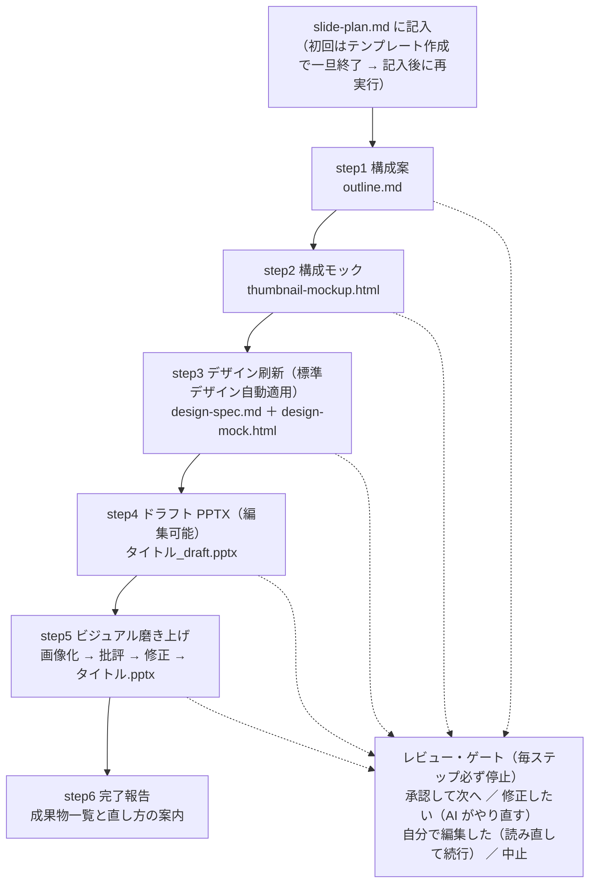

# ビジネス・デザイン系スキル（1個）

開発ワークフロー（beam / power）の外で使う、**ビジネス資料づくりのためのスキル**のグループ。現在は **slide-maker**（PowerPoint 資料の段階作成）の1個。

## 前提用語（初見の方向け）

| 用語 | 意味 |
|---|---|
| slide-plan.md（資料ブリーフ） | 「何の資料を作るか」を書く**入力ファイル**（作成資料概要・参考フォルダ・枚数・想定読者・目的）。これがワークフロー全体の起点 |
| HTML モック | ブラウザで開ける確認用ページ。全スライドをサムネイル一覧で表示し、構成やデザインを PPTX を作る前に確認できる |
| デザイントークン | 色・フォント・余白などデザインを構成する確定値のセット。`design-spec.md` に書き出され、以降の工程の「見た目の正」になる |
| 標準デザイン | 毎回自動適用される同梱デザイン（ダスティブルー×黒×白・角丸なし・縦書き英語ラベル・淡青と白の交互背景）。**デザイン選びで迷う工程は無い** |
| レビュー・ゲート | 各ステップの成果物を提示した後に**必ず**入る確認ストップ。4択（承認して次へ／修正したい／自分で編集した／中止）に答えて進む |
| レンダリング | PPTX を画像（PNG）に書き出すこと。見た目の崩れ（はみ出し・重なり）は画像でしか確認できないため、磨き上げで使う（PowerPoint を利用） |
| visual-rubric | 磨き上げの判定基準。A=欠陥（必ず直す）／B=デザイン原則（整列・余白・階層）／C=「AI が作ったっぽさ」の回避、の3層 |

## 一連のフロー

**「一気に完成品を出す」のではなく、構成案 → 構成モック → デザインモック → ドラフト → 最終版と段階的に育て、各段階で人間が確認してから次へ進む**のがこのスキルの設計思想（途中で軌道修正できるので、手戻りとハルシネーションに強い）。

1. **slide-plan.md に記入** — 初回実行時はテンプレートが作られて一旦終了するので、5項目（概要・参考フォルダ・枚数・想定読者・目的）を記入してから再度呼ぶ。
2. **step1 構成案** — 各スライドのタイトル・メインメッセージ・載せる内容（図解案含む）を文字で設計。参考フォルダがあれば事実を裏取りし、裏取りできない推測には `（要確認）` が付く。
3. **step2 構成モック** — 全スライドをサムネイル一覧の HTML にして「何がどう載るか・情報量は適切か」を目で確認。
4. **step3 デザイン刷新** — **標準デザインを自動適用**し、デザイン仕様（design-spec.md）とデザインモック（HTML）を確定。内容は一切変えない。
5. **step4 ドラフト PPTX** — 確定デザインで**編集可能な** PowerPoint を一度だけ生成（内部で PPTX 生成スキルに委譲）。
6. **step5 ビジュアル磨き上げ** — ドラフトを画像化し、第三者の目（サブエージェント）でルーブリック批評 → 修正して**最終版 PPTX** を生成。欠陥ゼロを画像で再確認。
7. **step6 完了報告** — 全成果物の一覧と、直したい場合の入口を案内。

---

## slide-maker

### 目的
資料ブリーフ（slide-plan.md）を起点に、**構成案 → 構成モック → デザインモック → ドラフト → 磨き上げ済み最終版**と、成果物を雪だるま式に積み上げて PowerPoint 資料を作るワークフロー。ポイントは3つ——①**各ステップで必ず止まり、人間が承認してから次へ進む**（勝手に完成品まで走らない）、②**デザインの検討は PPTX ではなく HTML モック上で行う**（反復が速く、PPTX は確定デザインで一度だけ組む）、③**最終版はスライドを画像化して目視基準（visual-rubric）で批評・修正**する（はみ出し・重なり・コントラスト事故は画像でしか見えないため）。

### 使用法

**初めて使うとき（2回の呼び出しになる）:**
1. 資料を作りたいフォルダで `/slide-maker` を実行 → `slide-plan.md` のテンプレートが作られ、**いったん終了**する
2. `slide-plan.md` の5項目（作成資料概要・参考フォルダ・枚数・想定読者・目的）を記入する——**参考フォルダを書くと内容の裏取りが効き、精度が大きく上がる**
3. もう一度 `/slide-maker` を実行 → step1 から順に進む

**進行中にやること（各ステップ共通）:**
- 成果物（ファイル＋プレビュー）が提示されたら確認し、4択に答える:
  - **承認して次へ** — このまま進める
  - **修正したい** — 直してほしい点を伝える → AI がこのステップだけやり直す
  - **自分で編集した** — ファイルを直接編集した場合はこれ → 読み直して次へ進んでくれる
  - **中止** — ここで終了（成果物は残る）

**どこを直したいかの対応表（迷ったらここ）:**

| 直したいこと | 編集するファイル | 再開するステップ |
|---|---|---|
| 資料の前提（目的・枚数・読者） | `slide-plan.md` | step1 からやり直し |
| スライドの内容・構成・図解案 | `outline.md` | step1 のゲートで「自分で編集した」／生成後なら `outline.md` を直して step1 からやり直し |
| デザインの方向（色・レイアウトの流儀） | `design-spec.md`、または見本（URL・画像・既存デッキ）を指定 | step3 |
| 仕上げの判定基準（磨き方の好み） | `visual-rubric.md` | step5 |

**知っておくとよいこと:**
- **デザインは選ばなくてよい**。標準デザインが毎回自動適用される。別デザインにしたい場合のみ「このデッキは別のデザインで」と見本を明示すると、見本からトークンを抽出して確認の上で上書きされる
- **生成・レンダリング中は対象の PPTX を PowerPoint で開いたままにしない**（ファイルロックで失敗する）
- 磨き上げ（step5）の画像チェックは **Windows ＋ PowerPoint がある環境でフル動作**する。PowerPoint が無くても **`soffice`（LibreOffice）＋ `pdftoppm` があれば画像化して目視レビューできる**。どちらも無い環境でのみ python-pptx の座標リント（スライド外はみ出し・bbox 重なり・余白・フォントサイズ・パレット外の色）にフォールバックし、「画像での目視はできていない」と明示される
- ドラフトと各モックは最終版の生成後も**削除されない**（比較・巻き戻し用）

### ステップ詳細

| step | 名称 | やること | 確認の観点（ゲートで何を見るか） |
|---|---|---|---|
| step0 | 準備 | `slide-plan.md` を自動検出（無ければテンプレ作成して終了）。`style-guide.md` を配置 | — |
| step1 | 構成案 | 各スライドの「タイトル・メインメッセージ（1スライド1メッセージ）・載せる内容・図解案」を設計。参考フォルダで裏取り | **話の流れと中身**は正しいか。`（要確認）` の箇所は事実か |
| step2 | 構成モック | 全スライドのサムネイル一覧 HTML を生成（その場でプレビュー表示も） | **各スライドに何がどう載るか・情報量**は適切か（見た目の好みは次で） |
| step3 | デザイン刷新 | 標準デザインを全スライドに適用し、`design-spec.md`（トークン）と `design-mock.html` を確定。**内容は変えない** | 標準デザインが**全スライドにきれいに当てはまっているか** |
| step4 | ドラフト PPTX | 確定デザインで**編集可能な** PowerPoint を生成（PPTX 生成スキルに委譲）→ 画像化して全枚提示 | **内容の最終確認**とデザインモックの再現度（細部の粗は次が拾う） |
| step5 | 磨き上げ | 画像化 → サブエージェントが visual-rubric（A 欠陥／B 原則／C AIっぽさ）で批評 → 修正して最終版を生成 → **欠陥ゼロを画像で再確認**（最大2周） | 仕上がりの品質。ビフォー/アフターと修正一覧が提示される |
| step6 | 完了報告 | 全成果物の一覧と「直したい場合の入口」を案内 | — |

### 生成物

すべて作業フォルダ内に生成される（上から順に積み上がる）:

| ファイル | 内容 |
|---|---|
| `slide-plan.md` | 資料ブリーフ（**あなたが記入する入力**） |
| `style-guide.md` | 初期デザイン指針（step3 以降は design-spec.md が優先） |
| `outline.md` | スライド構成案（タイトル・メッセージ・載せる内容・図解案） |
| `thumbnail-mockup.html` | 構成モック（全スライドのサムネイル一覧） |
| `design-spec.md` | 確定したデザイン仕様（トークン＋各スライドの縦ラベル語など） |
| `design-mock.html` | 確定デザインを全スライドに当てたデザインモック |
| `<タイトル>_draft.pptx` | ドラフト版 PowerPoint（比較・巻き戻し用に残る） |
| **`<タイトル>.pptx`** | **磨き上げ済みの最終版**（テキスト・図形が編集可能） |
