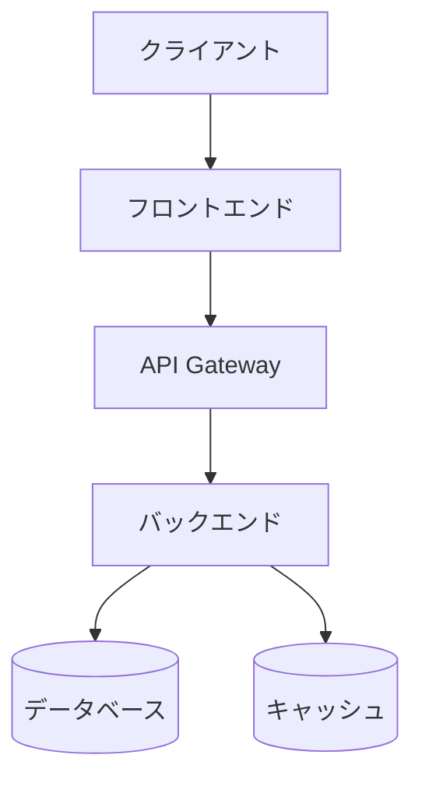

# {要件名} アーキテクチャ設計

**作成日**: {作成日時}
**関連要件定義**: [requirements.md](../requirements.md)
**ヒアリング記録**: [design-interview.md](design-interview.md)

**【信頼性レベル凡例】**:
- 🔵 **青信号**: PRD・要件定義書・既存の設計文書・ユーザヒアリングを参考にした確実な設計
- 🟡 **黄信号**: PRD・要件定義書・既存の設計文書・ユーザヒアリングから妥当な推測による設計
- 🔴 **赤信号**: PRD・要件定義書・既存の設計文書・ユーザヒアリングにない推測による設計

---

## システム概要 🔵

**信頼性**: 🔵 *要件定義書第1章より*

{システムの概要説明}

## アーキテクチャパターン 🔵

**信頼性**: 🔵 *CLAUDE.md技術スタック・既存設計より*

- **パターン**: {選択したパターン（例: クリーンアーキテクチャ、レイヤードアーキテクチャ、マイクロサービス）}
- **選択理由**: {選択理由の説明}

## サービス境界 / モジュール構成

**信頼性**: 🟡 *service-boundary 分析・ヒアリングより*

`service-boundary` スキルの判定結果を記載する。**既定はモジュラモノリス**（1 デプロイ内のモジュール境界）。
物理分離（別デプロイ）は「物理分離のバー」を越えた境界のみ。論理境界は下の「ディレクトリ構造」に実体化する。

### 境界候補（Bounded Context）

| 境界 | 責務 | 所有データ | 主アクター | 結合度 | 物理/論理 |
|---|---|---|---|---|---|
| {Context A} | {責務} | {所有テーブル/データ} | {アクター} | {同一/疎結合/別製品級} | {論理（既定）/物理候補} |

### 境界間の連携

- {Context B} → {Context A}（{同期呼び出し / イベント・結果整合}、{理由}）

### BFF

- {要否と理由。不要なら「不要（単一クライアント・集約不要）」}

### 将来の独立サービス候補

- {今は論理境界。{引き金条件（物理分離のバー）}を満たしたら抽出を検討}

### 却下した分割候補

- {分割しなかった候補とその理由（過分割回避の記録）}

## コンポーネント構成

### フロントエンド 🔵

**信頼性**: 🔵 *tech-stack.md・既存設計より*

- **フレームワーク**: {使用フレームワーク（例: React, Vue.js, Next.js）}
- **状態管理**: {状態管理方法（例: Redux, Zustand, Context API）}
- **UIライブラリ**: {UIライブラリ（例: Material-UI, Tailwind CSS）}
- **ルーティング**: {ルーティング方法}

### バックエンド 🔵

**信頼性**: 🔵 *tech-stack.md・既存設計より*

- **フレームワーク**: {使用フレームワーク（例: Express.js, NestJS, FastAPI）}
- **認証方式**: {認証方法（例: JWT, OAuth2, Session）}
- **API設計**: {API設計方針（例: REST, GraphQL, gRPC）}
- **ミドルウェア**: {使用するミドルウェア}

### データベース 🟡

**信頼性**: 🟡 *要件から妥当な推測*

- **DBMS**: {使用するDBMS（例: PostgreSQL, MySQL, MongoDB）}
- **キャッシュ**: {キャッシュ戦略（例: Redis, Memcached）}
- **接続方法**: {ORM/ODM（例: Prisma, TypeORM, Mongoose）}

## システム構成図



**信頼性**: 🔵 *要件定義・既存設計より*

## ディレクトリ構造 🔵

**信頼性**: 🔵 *既存プロジェクト構造より*

```
./
├── src/
│   ├── {主要ディレクトリ1}/
│   ├── {主要ディレクトリ2}/
│   └── {主要ディレクトリ3}/
├── tests/
├── docs/
└── {その他の主要ディレクトリ}
```

## 非機能要件の実現方法

### パフォーマンス 🟡

**信頼性**: 🟡 *NFR要件から妥当な推測*

- **レスポンスタイム**: {目標値と実現方法}
- **スループット**: {目標値と実現方法}
- **最適化戦略**: {キャッシング、レイジーロード等}

### セキュリティ 🔵

**信頼性**: 🔵 *NFR要件・セキュリティ設計より*

- **認証・認可**: {実装方法}
- **データ暗号化**: {暗号化方式}
- **脆弱性対策**: {XSS, CSRF, SQLインジェクション等の対策}

### スケーラビリティ 🟡

**信頼性**: 🟡 *NFR要件から妥当な推測*

- **水平スケーリング**: {スケーリング戦略}
- **負荷分散**: {ロードバランサー等}
- **データベースシャーディング**: {必要に応じて}

### 可用性 🟡

**信頼性**: 🟡 *NFR要件から妥当な推測*

- **目標稼働率**: {SLA目標}
- **障害対策**: {フェイルオーバー、リトライ等}
- **監視・アラート**: {監視方法}

## 技術的制約

### パフォーマンス制約 🔵

**信頼性**: 🔵 *CLAUDE.md・要件定義より*

- {制約事項1}
- {制約事項2}

### セキュリティ制約 🔵

**信頼性**: 🔵 *CLAUDE.md・要件定義より*

- {制約事項1}
- {制約事項2}

### 互換性制約 🔵

**信頼性**: 🔵 *CLAUDE.md・tech-stack.mdより*

- {制約事項1}
- {制約事項2}

## 関連文書

- **データフロー**: [dataflow.md](dataflow.md)
- **ヒアリング記録**: [design-interview.md](design-interview.md)
- **型定義** （フル機能開発時のみ）: [interfaces.ts](interfaces.ts)
- **DBスキーマ** （フル機能開発時のみ）: [database-schema.sql](database-schema.sql)
- **API仕様** （フル機能開発時のみ）: [api-endpoints.md](api-endpoints.md)
- **要件定義**: [requirements.md](../requirements.md)
- **PRD**: [product-requirements.md](../product-requirements.md)

## 信頼性レベルサマリー

- 🔵 青信号: {件数}件 ({割合}%)
- 🟡 黄信号: {件数}件 ({割合}%)
- 🔴 赤信号: {件数}件 ({割合}%)

**品質評価**: {高品質/要改善/要ヒアリング}
