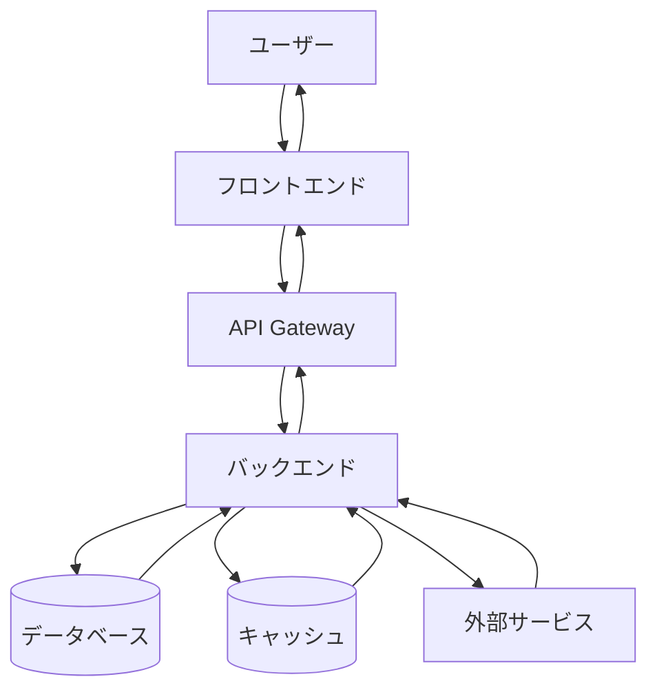
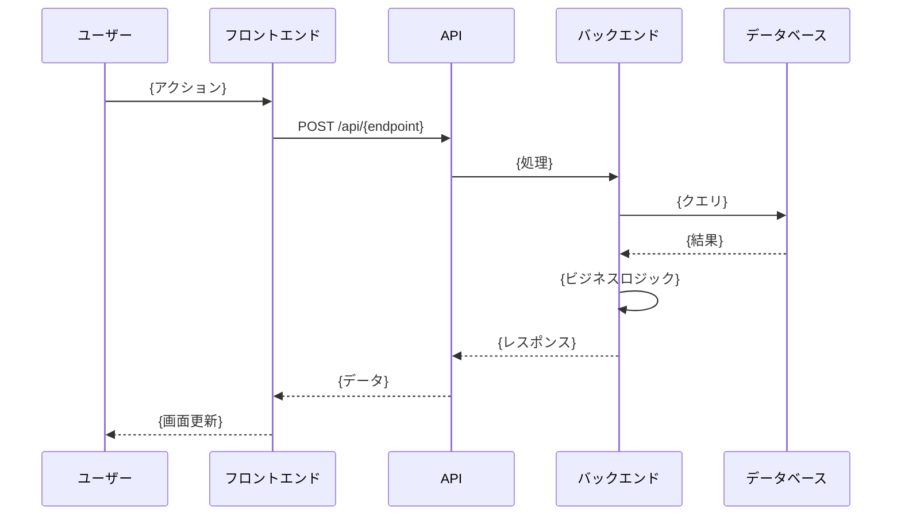
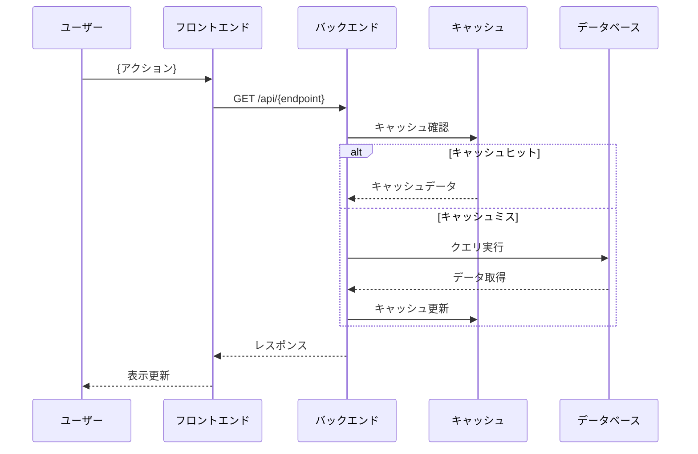
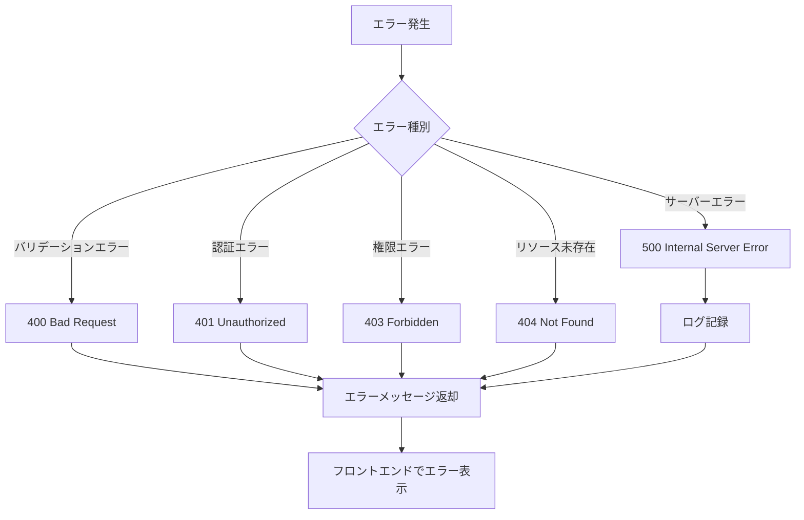
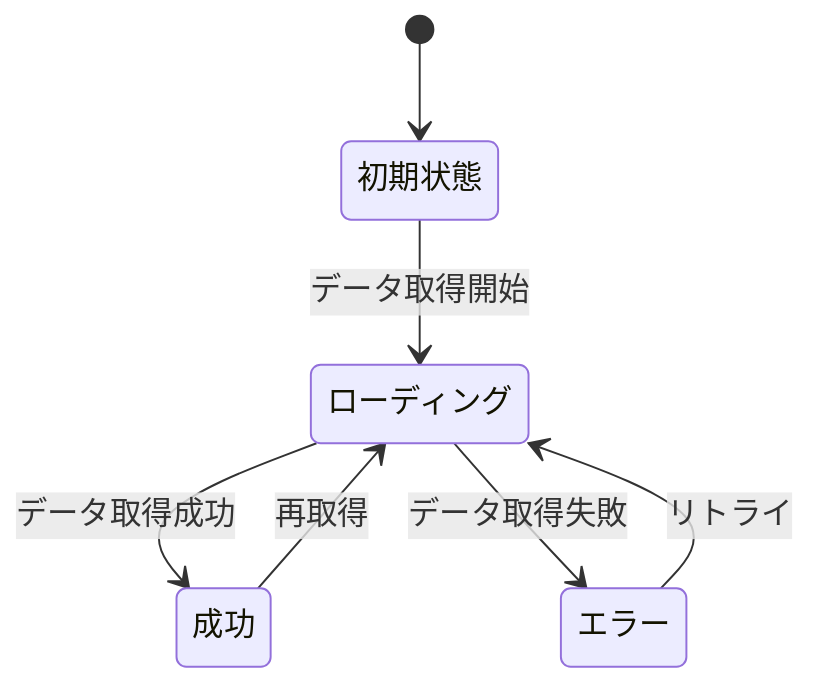

# {要件名} データフロー図

**作成日**: {作成日時}
**関連アーキテクチャ**: [architecture.md](architecture.md)
**関連要件定義**: [requirements.md](../requirements.md)

**【信頼性レベル凡例】**:
- 🔵 **青信号**: PRD・要件定義書・既存の設計文書・ユーザヒアリングを参考にした確実なフロー
- 🟡 **黄信号**: PRD・要件定義書・既存の設計文書・ユーザヒアリングから妥当な推測によるフロー
- 🔴 **赤信号**: PRD・要件定義書・既存の設計文書・ユーザヒアリングにない推測によるフロー

---

## システム全体のデータフロー 🔵

**信頼性**: 🔵 *要件定義・ユーザーストーリーより*

## 主要機能のデータフロー

### 機能1: {機能名} 🔵

**信頼性**: 🔵 *ユーザーストーリー1.1・受け入れ基準TC-001より*

**関連要件**: REQ-001, REQ-002

**詳細ステップ**:
1. {ステップ1の詳細説明}
2. {ステップ2の詳細説明}
3. {ステップ3の詳細説明}

### 機能2: {機能名} 🟡

**信頼性**: 🟡 *要件から妥当な推測*

**関連要件**: REQ-101

**備考**: {この推測の根拠や確認が必要な理由}

## データ処理パターン

### 同期処理 🔵

**信頼性**: 🔵 *アーキテクチャ設計より*

{同期処理が必要な機能とその理由}

### 非同期処理 🟡

**信頼性**: 🟡 *パフォーマンス要件から妥当な推測*

{非同期処理が必要な機能とその理由}

### バッチ処理 🟡

**信頼性**: 🟡 *要件から妥当な推測*

{バッチ処理が必要な機能とその理由}

## エラーハンドリングフロー 🟡

**信頼性**: 🟡 *既存実装パターンから妥当な推測*

## 状態管理フロー

### フロントエンド状態管理 🔵

**信頼性**: 🔵 *tech-stack.md・既存実装より*

### バックエンド状態管理 🟡

**信頼性**: 🟡 *要件から妥当な推測*

{状態管理の詳細}

## データ整合性の保証 🟡

**信頼性**: 🟡 *NFR要件から妥当な推測*

- **トランザクション管理**: {トランザクション戦略}
- **楽観的ロック/悲観的ロック**: {ロック戦略}
- **整合性チェック**: {整合性確認方法}

## 関連文書

- **アーキテクチャ**: [architecture.md](architecture.md)
- **ヒアリング記録**: [design-interview.md](design-interview.md)
- **型定義** （フル機能開発時のみ）: [interfaces.ts](interfaces.ts)
- **DBスキーマ** （フル機能開発時のみ）: [database-schema.sql](database-schema.sql)
- **API仕様** （フル機能開発時のみ）: [api-endpoints.md](api-endpoints.md)
- **要件定義**: [requirements.md](../requirements.md)
- **PRD**: [product-requirements.md](../product-requirements.md)

## 信頼性レベルサマリー

- 🔵 青信号: {件数}件 ({割合}%)
- 🟡 黄信号: {件数}件 ({割合}%)
- 🔴 赤信号: {件数}件 ({割合}%)

**品質評価**: {高品質/要改善/要ヒアリング}
