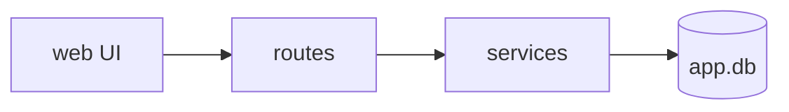

# code-map の図と根拠リファレンス

既存システムの理解を **図（人間が見て分かる）** と **根拠（機械が検証できる）** の両輪で残すための基準。作図規律に ID（DG-1 等）を振る——指摘・記録では ID で引用する。

## 0. 使い方（最優先）

- **power2-understand** — step3-4 で `docs/code-map.md` の「全体像」を書くときに読む。3種の図と根拠表を作る。
- **power6-verify** — code-map を最終更新したあと、根拠の再検証を行う。
- **既存の code-map があっても、図と根拠が無ければこの基準に従って起こし直す**。とくに **beam5 製の code-map は索引だけで全体像の節を持たない**ので、地図は丸ごと新規に書くことになる。「ファイルが存在する＝地図がある」ではない。
- **なぜ図を描くのか（2つの目的）**:
  1. **AI 自身の理解を構造化するため**。散文は曖昧なまま書けてしまうが、図はノードと辺を決めないと描けない。「どこに何があり、何がどう繋がるか」を確定させる強制力がある。
  2. **人間がレビューできるようにするため**。power の推奨運用は「power4 まで進めて人間がレビュー → power5」だが、レビュー対象が散文だけだと**AI の理解が正しいかを短時間で判定できない**。図があれば誤解を早期に潰せる。
- **Mermaid で描く**（外部ツール・座標指定は不要）。座標や配線を手で置く形式は、**コード理解に使うべき労力を幾何計算に溶かす**ので採らない。

---

## 1. 3種の図（何を描くか）

**種別に応じて非該当のものはスキップし、理由を一言述べる**。全部描くことが目的ではない。

| 図 | 答える問い | 必須の目安 |
|---|---|---|
| **A. 構成（architecture）** | 何がどこにあるか。層・モジュール・境界・外部依存 | **原則必須** |
| **B. 主要フロー（sequence）** | 1つの代表的な要求が入口から出口までどう流れるか | **HTTP API・CLI・ジョブ等、明確な入口があるなら必須** |
| **C. データの流れ（dataflow）** | データがどこから来て、どこへ書かれるか | 永続化・外部データ源があるなら推奨 |

- **B は最も効く**。「1本のリクエストを入口から出口まで追う」のは既存システム理解の定番で、ここを描けないなら理解できていない。
- **今回の機能が乗るフローを優先**する。システム全体の網羅は目的ではない（code-map の既存方針と同じ）。

### 書き方（Mermaid）

````markdown
### A. 構成



| ノード | 根拠 |
|---|---|
| web | `src/web/main.ts:1-40` |
| routes | `src/server/routes/index.ts:12-48` |
| svc | `src/server/services/task.ts:1-120` |
| db | `src/server/db/schema.sql:1-60` |
````

**図のノードには根拠を書かず、直下の対応表に置く**——図の可読性を保ちつつ、根拠を機械検証しやすい形にするため。

---

## 2. 作図規律（DG-1〜DG-5）

- **DG-1 1つの明白なメインパスを先に作る** — 枝は最寄りのメインパスノードから出す。全部を対等に並べると「何が主役か」が消える。
- **DG-2 主要ノードは最大12** — 超えるなら抽象度を上げる（個別ファイルではなくモジュール／層で束ねる）。詳細は索引（モジュール一覧）が持つ。
- **DG-3 制御を足す前に、価値の低い辺を削る** — 図が読みにくいときの第一手は「線の描き方を工夫する」ではなく「**描かなくてよい関係を消す**」。
- **DG-4 ラベルは意味データ** — 辺のラベル（プロトコル・向き・同期/非同期・境界越えの手段）は情報であって装飾ではない。**両端点から完全に自明な場合を除き、消さない**。
- **DG-5 憶測を描かない（最重要）** — 図に描いてよいのは**実コードで確認したものだけ**。「たぶんこうなっている」は図にせず、`understanding-brief.md` の未解決論点に回す。図は「確からしい仮説」ではなく「確認した事実」を運ぶ器として扱う。

---

## 3. 根拠の記法と検証

### 記法（この形以外は検証されない）

バッククォートで囲み、**リポジトリルート相対の POSIX パス** ＋ 行または行範囲:

```
`src/server/routes/tasks.ts:12`         単一行
`src/server/routes/tasks.ts:12-48`      行範囲
`./main.py:10`                          ルート直下のファイル（`./` を付ける）
```

検出条件は **バッククォート内 ＋ `/` を含む ＋ 拡張子を持つ ＋ `://` を含まない** の4つ。これを外れた文字列は「根拠ではない散文」とみなされ、検証もされない。

- **`/` が必須** — `127.0.0.1:8080` のようなホスト:ポートを誤検出しないための規則。したがって**ルート直下のファイルは必ず `./` を付ける**（`./main.py:10`）。`package.json` とだけ書くと検証されない。
- **拡張子が必須** — `GET /api/tasks` のような散文中のパスを誤検出しないための規則。したがって**ディレクトリは根拠にできない**（`src/server/` は検証対象外）。ディレクトリ単位で示したいときは、その代表ファイルを指す。
- 絶対パス・`..`・`.git` 配下は不正（検証で落ちる）。
- 行番号は**任意**（`src/server/routes/tasks.ts` だけでも検証対象になり、ファイルの実在が確認される）。行を書いた場合はその行が実在することまで検証される。

> 検証されない書き方をしても**エラーにはならず、黙って検証対象から外れる**だけ。根拠を書いたつもりで検証されていない事故を防ぐため、検証コマンドが出力する「検証した根拠: N 件」の N が、**書いた根拠の数と一致しているかを必ず確認する**。

### 検証リビジョンの記録

code-map の冒頭に、**どの時点のコードに対して根拠を検証したか**を記録する:

```markdown
> **検証リビジョン**: `<40桁の完全な commit SHA>`
```

- **code-map を更新したら、このリビジョンも更新して再検証する**。放置すると「昔は正しかった根拠」が残り、信用できなくなる。

### 検証コマンド

スクリプトは `power2-understand/scripts/verify-code-map-evidence.sh`。**呼び出し方（パスの辿り方）は power2-understand の SKILL.md の step3-4 に従う**（ここに同じコードを複製しない。呼び出し方を変えるときに片方だけ古くなるため）。

- スクリプトは**スキルの置き場所から辿る**。作業ディレクトリからの相対パスや `$HOME/.claude` を基準にすると、`cd` した後のコンテナや、Windows から WSL を呼ぶ環境で見つからなくなる。
- 対象ファイル（`docs/code-map.md` → `code-map.md`）とリビジョン（冒頭の「検証リビジョン」行）は自動検出。`--file <path>` / `--rev <SHA>` で明示指定も可。
- 依存は **bash と git のみ**（power の対象は任意スタックのレガシーもあるため、node/python に依存させていない）。
- 終了コード: `0` 全件OK / `1` 検証失敗あり / `2` 実行エラー（git 外・code-map 不在・SHA 不明）。

検証内容:

| 検査 | 内容 |
|---|---|
| パス安全性 | 絶対パス・`..`・`.git` 配下を拒否 |
| ファイル実在 | 記録したリビジョン時点でそのパスが blob として存在するか |
| 行の実在 | 要求した行（範囲の末尾）がその時点のファイル行数を超えていないか |

### 信頼性レベルとの関係（重要）

power の成果物は各項目に 🔵 確実 / 🟡 妥当な推測 / 🔴 推測 を付ける。**根拠の検証はこの判定を機械で裏打ちするためにある**:

- **🔵 を名乗ってよいのは、検証を通った根拠が付いている項目だけ**。AI が「確認した」と自己申告しただけのものは 🔵 にしない。
- 検証が落ちた根拠は、パスを直すか、**🟡 に格下げする**。
- 根拠を付けられない理解（コードからは読み取れなかった意図・経緯など）は 🟡/🔴 のまま残し、`understanding-brief.md` の未解決論点に送る。

> **なぜここまでするか**: AI が書いたものを同じ AI が確認しても、同じ前提（盲点）が入るため信用が積み上がらない。**機械的に検証できる形にしておけば、AI の自己申告に依存せずに 🔵 を主張できる**。これは coding-principles の E-1〜E-4 と同じ考え方——自己評価ではなく機械的検査で担保する。

---

## 収録しない／参照に留めるもの

- **索引（モジュール一覧）の書式** → `templates/code-map-template.md`。本書は「全体像」側の図と根拠だけを扱う。
- **どこまで探索するか（ドキュメント信頼度による深さ調整）** → power2 本体の step2。
- **統合点・回帰リスク（INT/REG/CON）の確定** → `understanding-brief.md`。図はあくまで俯瞰であり、統合点の詳細はブリーフが持つ。
