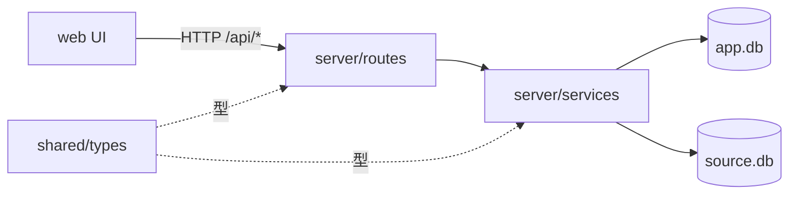
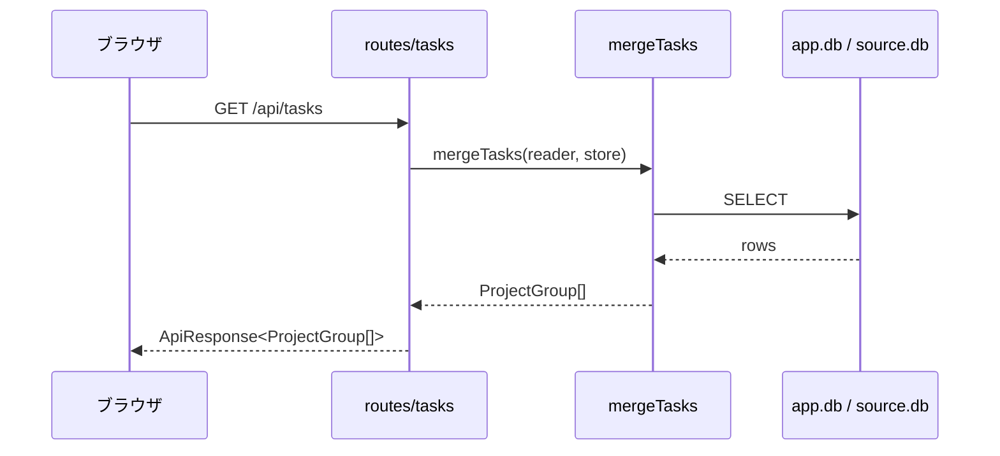
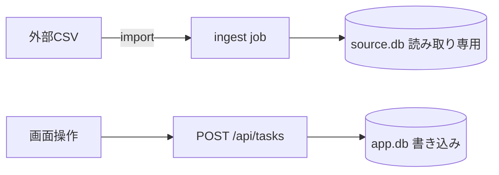

# {対象システム} コードマップ（全体像 ＋ 現状インデックス）

> **役割**: 既存システムの **「地図（全体像）」** と **「索引（モジュール現状）」**。`power2-understand` が生成し、`power5`/`power6` が更新する。実装サブエージェントは実装前に必ず読み、**全体像で変更の波及を把握**し、**索引で既存シンボルを再利用して重複実装を避ける**。
> **更新ルール**: 各工程完了時に**現状を上書き更新**する（履歴は残さない）。常に「今あるもの」だけを反映する。
> **最終更新**: {工程／フェーズ}
> **検証リビジョン**: `{40桁の完全な commit SHA}`

<!-- 検証リビジョン = 下記の根拠（`path:line`）を検証した時点のコミット。
     code-map を更新したらこの SHA も更新し、次のコマンドで再検証すること:
       bash .claude/skills/power2-understand/scripts/verify-code-map-evidence.sh
     記法と規律は references/code-map-diagrams.md を参照。 -->

---

## 全体像（アーキテクチャ地図）★まず方向づけのために読む

> システムの「形」を俯瞰で示す。**簡潔に**（全コードの再ダンプはしない）。詳細は下の「モジュール一覧」をオンデマンドで読む。

### アーキタイプ・層構成
- {例: モジュラモノリス。`src/server`（API/サービス/DB）＋ `src/web`（フロント）＋ `src/shared`（共通型）の3層}

### 図A. 構成（architecture）★原則必須

> 何がどこにあるか。層・モジュール・境界・外部依存。**主要ノードは最大12**（DG-2）。



| ノード | 根拠 |
|---|---|
| web | `src/web/main.ts:1-40` |
| routes | `src/server/routes/index.ts:12-48` |
| svc | `src/server/services/task.ts:1-120` |
| appdb | `src/server/db/schema.sql:1-60` |

- **注記**: {循環依存・密結合・レイヤ違反があれば明記。無ければ「なし」}

### 図B. 主要フロー（sequence）★入口があるなら必須

> 代表的な要求1本を入口から出口まで。**今回の機能が乗るフローを優先**する（網羅は目的ではない）。



| 参加者・処理 | 根拠 |
|---|---|
| routes/tasks | `src/server/routes/tasks.ts:15-62` |
| mergeTasks | `src/server/services/merge.ts:30-95` |
| ApiResponse | `src/shared/api.ts:1-24` |

### 図C. データの流れ（dataflow）※永続化・外部データ源があるなら推奨

> データがどこから来て、どこへ書かれるか。**該当しなければこの節ごと削除し、理由を一言残す**。



| ノード | 根拠 |
|---|---|
| ingest | `src/server/jobs/ingest.ts:1-80` |
| api | `src/server/routes/tasks.ts:64-98` |

### エントリポイント
- {実行の起点。例: `src/server/index.ts`（startServer, 127.0.0.1:PORT）/ `src/web/main.ts`（フロント）/ CLI 等}

### ディレクトリ構造の俯瞰
```
{例}
src/
  server/   … API・サービス・DB（バックエンド）
  web/      … フロント
  shared/   … 共通型・ApiResponse
docs/ , data/ , ...
```

---

## 確立された規約・共通方針

- {命名規則・エラー処理パターン・配置方針・テスト方針など、プロジェクト全体で守られている約束}

## モジュール一覧

> 索引部分。**beam5 互換**フォーマット（`power5` の tdd/direct-implement がここを読む）。

### {ファイルパス（例: src/server/services/foo.ts）}

- **責務**: {このモジュールが担うこと}
- **公開シンボル**:
  - `{関数名(引数)}` — {概要}
  - `{型名 / クラス名}` — {概要}
- **依存**: {依存する他モジュール・外部ライブラリ}
- **規約・注意**: {このモジュール固有の約束・落とし穴}
- **申し送り**: {後続が知るべきこと}

### {ファイルパス}

- **責務**: {...}
- **公開シンボル**: `{...}` — {...}
- **依存**: {...}
- **規約・注意**: {...}

## 設計契約との差分

実装過程で `docs/spec/{機能名}/design/` の契約から変更した点を記録する（無ければ「なし」）。

- {変更したファイル}: {変更内容と理由}

## 未解決・次工程への課題

- {仮実装・TODO・後続工程で対応すべき項目（あれば）}
