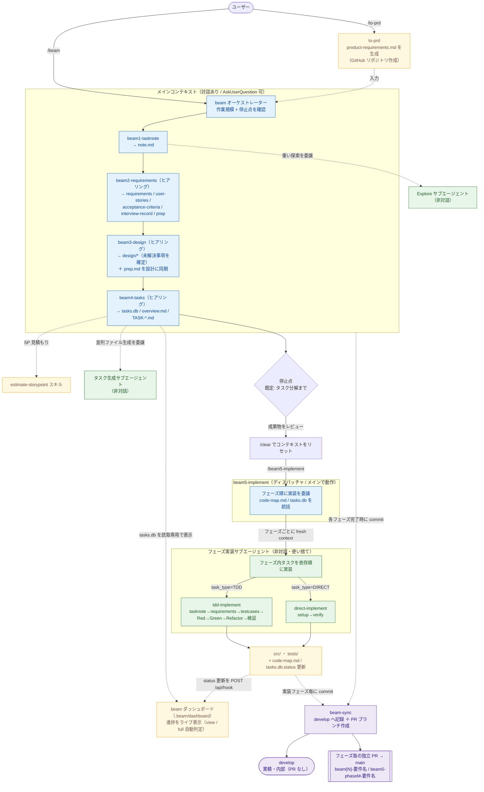
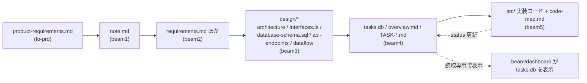
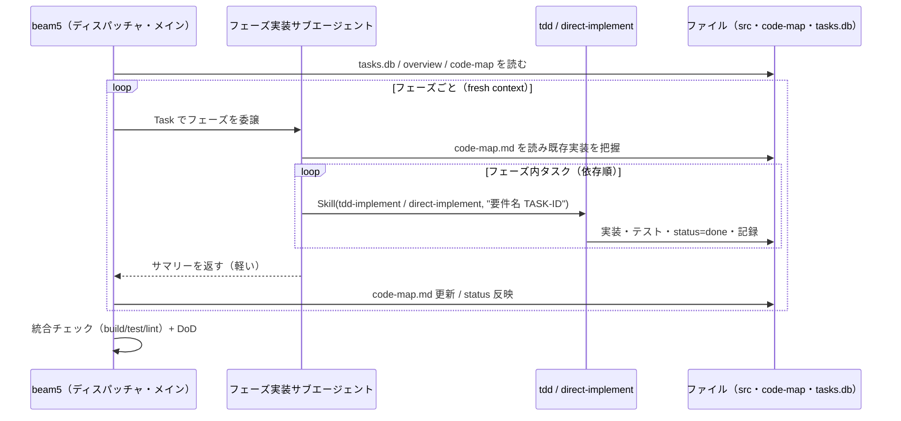
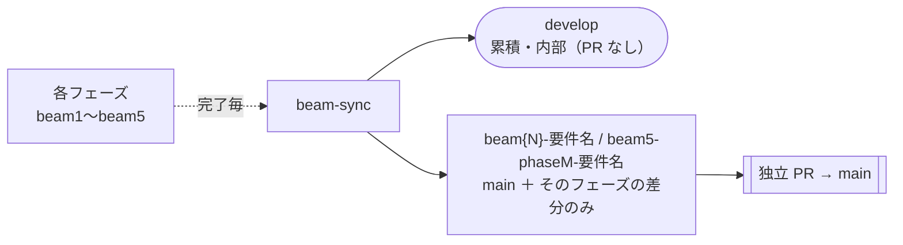

# beam ワークフロー アーキテクチャと実行フロー

PRD からタスク分解までを自動化し、その後の実装フェーズまでつなぐアプリ作成ワークフロー「beam シリーズ」の構造と動作フローをまとめたドキュメント。

> **重要な前提（設計の核）**
> - **対話するフェーズ（beam1〜4）はメインコンテキストで動く。** サブエージェント（Task）内では `AskUserQuestion` がユーザーに届かないため、ヒアリングを含むフェーズはメインで `Skill` 実行する。
> - **重い非対話処理だけサブエージェントに委譲する。**（コードベース探索・並列ファイル生成・実装など）
> - **ファイル＝state。** フェーズ間の情報引き継ぎは会話履歴ではなくファイル（`note.md` → `requirements.md` → `design/*` → `tasks.db` → `src/`）で行う。
> - 旧 `beam-runner` サブエージェントは廃止（上記の対話制約により、フェーズ全体をサブエージェントで包む設計をやめた）。

---

## 1. 全体フロー（Mermaid）



### データフロー（ファイル＝state）



### beam5 実装フェーズの内部（シーケンス）



---

## 2. コンポーネントとファイル構成

```
~/.claude/
├── skills/
│   ├── to-prd/                  PRD 作成（前段）
│   ├── beam/                    オーケストレーター（beam1〜4 を停止点まで実行）
│   ├── beam1-tasknote/          コンテキスト収集 → note.md
│   ├── beam2-requirements/      要件定義(EARS) → requirements ほか
│   ├── beam3-design/            技術設計 → design/*
│   ├── beam4-tasks/             タスク分解・SP見積もり → tasks.db / TASK-*
│   ├── beam5-implement/         実装ディスパッチャ（個別実行）
│   ├── estimate-storypoint/     SP見積もり（beam4 が呼ぶ補助）
│   ├── tdd-implement/           1タスクを TDD で実装（beam5 が呼ぶ）
│   ├── direct-implement/        1タスクを設定系で実装（beam5 が呼ぶ）
│   └── beam-sync/               Git 連携（各フェーズが develop へ commit / main へ PR）
└── docs/rule/
    └── ai-security-guardrails.md  セキュリティ・ガードレール（P0/P1）

（各プロジェクト側）
docs/spec/{要件名}/    note・要件・設計（beam1〜3）
docs/tasks/{要件名}/   overview・TASK-*・code-map（beam4〜5）
data/tasks.db          タスク管理 SQLite（beam4 作成）
docs/implements/{要件名}/{TASK-ID}/  実装記録（tdd/direct-implement）
src/ ほか              実装コード（beam5）
.beam/dashboard/       task-bridge 本体一式（タスクダッシュボード。自己完結・src 含む）
```

> `beam-runner.md`（旧サブエージェント）は廃止済み。`agents/` には beam 用サブエージェントは置かない。

---

## 3. 2つの実行モデル

beam は性質の異なる2種類のフェーズを使い分ける。

| | beam1〜beam4（要件〜タスク分解） | beam5-implement（実装） |
|---|---|---|
| 性質 | **対話あり**（ヒアリングが核心） | **非対話**（決定は beam1〜4 で確定済み） |
| 実行場所 | **メインコンテキスト**で `Skill` 直接実行 | ディスパッチャはメイン、各フェーズは**サブエージェント** |
| 起動 | `/beam`（オーケストレーター）が順に実行 | `/beam5-implement` を**個別実行**（オーケストレーター対象外） |
| コンテキスト軽減 | 各フェーズが内部で重い非対話処理だけ委譲（Explore・並列生成） | フェーズ境界でサブエージェントを使い捨て＝リセット |

### なぜ beam1〜4 はメインで動くのか

サブエージェント（Task）内では `AskUserQuestion` がユーザーに届かない。要件・設計・タスク分解はヒアリングが質を決めるため、これらは**メインで実行**しなければならない。重い処理（コードベース探索・タスクファイルの並列生成など）だけを、各フェーズが内部でサブエージェントに委譲する。

### なぜ beam5 は分離・ディスパッチャなのか

実装は重く、`/clear` でコンテキストをリセットしてから始めるのが最もクリーン（beam5 はすべてファイルから状態を復元できる）。オーケストレーターは既定で**タスク分解まで**で止まり、成果物（要件・設計・タスク）を人間がレビューしてから `/beam5-implement` を実行する。beam5 はディスパッチャとしてメインで動き、フェーズごとに非対話サブエージェントを起動する。

---

## 4. オーケストレーター（/beam）の流れ

1. **要件名の確定**（`pwd`）と PRD 確認
2. **作業規模**を AskUserQuestion で確認（フル機能開発 / 軽量開発 / カスタム）
3. **停止点**を確認（要件定義まで / 設計まで / **タスク分解まで（既定）**）。実装はここでは行わない
4. 停止点までのフェーズを **`Skill({skill, args: work_scope})` でメイン実行**
   - beam1 → beam2 → beam3 → beam4（各フェーズ完了後にサマリー提示）
   - 各フェーズは完了時に `beam-sync` を呼び、`develop` へコミット＋**フェーズ専用ブランチで `main` へ独立 PR を作成**（beam1〜5 がそれぞれ自分の PR。§9 参照）
5. 完了報告。タスク分解まで終わったら「**`/clear` → `/beam5-implement`**」を案内

---

## 5. 実装エンジン（tdd-implement / direct-implement）

beam5 のフェーズサブエージェントは、各タスクの `task_type` に応じて実装スキルを `Skill` で呼ぶ。

- **tdd-implement**（TDD タスク）: tasknote→requirements→testcases→**Red→Green→Refactor**→完全性検証。記録は `docs/implements/{要件名}/{TASK-ID}/`（requirements / testcases / memo / verify-report）。
- **direct-implement**（DIRECT タスク）: setup→verify。環境構築・設定・依存・DB 初期化、README/CLAUDE.md 更新。

共通: セキュリティ P0 遵守、`tasks.db` の `status` 更新（`in_progress`→`done`）、実データでの動作確認。

### フェーズ間の知識引き継ぎ: code-map.md

`docs/tasks/{要件名}/code-map.md` に「**今あるモジュール → 責務 → 公開シンボル → 規約 → 申し送り**」を**現状インデックス**として保持（履歴は残さない）。新フェーズのサブエージェントはこれを読んで既存実装を再利用し、重複を避ける。

---

## 6. タスク管理 DB（data/tasks.db）

- beam4 が作成。テーブル名 = **要件名（ケバブケース）**、`task_id` は **TEXT（"TASK-0001"）**。
- 主な列: `phase, task_id, status, title, content, task_type, story_point, buffer_percent, complexity, blocked_by, notion_sync_status, update_badge, is_deleted, task_file`。
- `status`: `ready` / `in_progress` / `in_review` / `done`。
- メタテーブル `_projects`（プロジェクト一覧）併設。日時は JST。
- beam5 が status を更新し、**ダッシュボード**が読取専用で表示する。

---

## 7. 補助：見積もり・ダッシュボード

- **estimate-storypoint**: beam4 のタスク詳細化（4.3.2）から呼ばれ、各タスクの**ストーリーポイント・不確実性バッファ・複雑度**を算出（工数ではなく相対規模）。アンカー基準は `rules/anchors.md`。
- **beam ダッシュボード（.beam/dashboard）**: **task-bridge 本体一式を自己完結で配置したツール**（`.beam/dashboard/` に `src` 含む。製品の `src/` を占有しないため beam 配下に置く）。`data/tasks.db` を読取専用で表示し、`.env` に Notion 資格情報があれば **full（Notion 連携）**、無ければ **view（閲覧専用）** を自動判定。実装中に進捗をライブ表示（hook→SSE）。詳細は `task-bridge-manual.md`。

---

## 8. データの受け渡し（ファイル＝state）

各 beam スキルは「前段の生成物（ファイル）を読み、自分の生成物（ファイル）を書く」だけ。これにより：

- **疎結合**：フェーズは独立して動作・再実行できる
- **コンテキスト非依存**：会話履歴が無くてもファイルから状態を復元できる（`/clear` 後の beam5 が成立する理由）
- **可読性**：中間生成物がそのまま人間にも読めるドキュメントとして残る

```
to-prd → product-requirements.md
beam1  → note.md
beam2  → requirements.md / user-stories.md / acceptance-criteria.md / interview-record.md / prep.md
beam3  → design/architecture.md / dataflow.md / interfaces.ts / database-schema.sql / api-endpoints.md / prep.md（設計確定を反映して更新）
beam4  → overview.md / TASK-*.md / data/tasks.db
beam5  → src/・tests/ / code-map.md（+ docs/implements/{要件名}/{TASK-ID}/）
```

---

## 9. Git 連携（beam-sync）

beam が生成したファイルを GitHub に反映する Git 処理は、専用スキル **`beam-sync`** に集約している（各フェーズの完了時に `Skill` 経由で呼ばれる）。冪等で、秘密情報は決してコミットしない。



- **ブランチ運用**: 生成物は累積ブランチ **`develop`**（内部用・PR は出さない）に記録。`develop` が無ければ `main` から自動作成。`main` へは直接コミットせず **PR 経由**のみ。
- **コミット単位**: **フェーズごと**に 1 コミット（`beam1: コンテキストノート` … `beam5: 実装`）。差分が無ければスキップ（冪等）。
- **PR（フェーズごとに独立）**: **各フェーズが専用ブランチを `main` から切り出し、そのフェーズの差分だけを載せた独立 PR を作成**する。ブランチ名は beam1〜4 が `beam{N}-{要件名}`、**beam5 は実装フェーズごとに `beam5-phase{M}-{要件名}`**（実装フェーズの数だけ PR ができる）。beam1〜4 は生成パスが重ならず順不同マージ可。**`code-map.md` は内部インデックスのため PR には載せず `develop` に保持**（beam5 の実装フェーズ間で PR が衝突しないように）。beam5 の PR が同じソースを変更する場合は依存順にマージする。**1 つの PR を更新し続けない**。
- **PR の説明（body）**: 自動生成。**【概要】**（日本語の散文）→ **【フェーズ要約】**（要件件数・SP・要件カバレッジ・テスト結果などを生成ファイルから抽出）→ **【変更一覧】**（`ファイル` ／ `変更の概要` の表）の3欄構成。再実行時は body も最新化する。
- **除外**: `data/tasks.db`（バイナリ。`TASK-*.md` から再生成可）と `.env`・`node_modules`・`dist`・`logs`・`.beam/dashboard` の生成物は `.gitignore` で除外。
- **セキュリティ（P0）**: `.env` 等のシークレットは `.gitignore` ＋コミット直前の二重ガードで**絶対にコミットしない**。force push・履歴改変・`main` 直コミットはしない。
- **前提**: 実行環境（beam1〜4＝メインの Bash、beam5＝DevContainer）に `gh` 認証（`repo` スコープ）と git identity が必要。未設定時は `beam-sync` が手順を案内してスキップ（フェーズ自体は続行）。

---

## 10. 設計ポリシー

| 原則 | 実装 |
|---|---|
| **対話はメイン・重処理はサブ** | beam1〜4 はメインで AskUserQuestion、重い非対話処理だけサブエージェントへ |
| **ファイル＝state** | フェーズ間はファイル経由。`/clear` 後も復元可能 |
| **コンテキスト分離** | beam5 はフェーズ境界でサブエージェントを使い捨て |
| **疎結合・再実行可能** | 各スキルは単独でも `/beamN-...` で実行可 |
| **停止点でレビュー** | 既定でタスク分解まで。実装は人間レビュー後に個別実行 |
| **信頼性可視化** | 🔵🟡🔴 で各項目の根拠の強さを明示。未解決事項は beam3 で確定 |
| **セキュリティ常時適用** | 実装は `docs/rule/ai-security-guardrails.md` の P0 を遵守 |
| **テスト全通過 ≠ 動く** | beam5 は実データ・実環境での動作確認を必須化 |
| **要件トレーサビリティ・ゲート** | 要件の取りこぼしを各境界で機械的に検出する。beam4 で REQ→TASK カバレッジ照合（未カバーは完了不可）、beam5 で 受け入れ基準＝テストの 1:1 対応 と 要件適合レポート（`conformance-report.md`、全要件を根拠付きで判定し ❌ ゼロを必須） |

---

## 11. よくある質問

**Q. beam-runner はどこ？** 廃止しました。サブエージェント内で AskUserQuestion が使えないため、対話フェーズ（beam1〜4）はメインで実行します。

**Q. 1 フェーズだけ実行したい。** `/beam2-requirements` のように直接スキルを呼べます（メインで動くのでヒアリングも機能）。

**Q. 実装前になぜ /clear？** beam5 はファイルから状態を復元するため会話履歴が不要。リセットしてから始めると最も軽量・確実です（`/clear` 前に成果物がファイル保存済みであること）。

**Q. tdd/direct-implement は単独で使える？** はい。`tdd-implement {要件名} {TASK-ID}` のように直接実行できます。

---

## 12. 関連ファイル

- オーケストレーター: `~/.claude/skills/beam/SKILL.md`
- 各フェーズ: `~/.claude/skills/beam{1..5}-*/SKILL.md`
- 実装エンジン: `~/.claude/skills/{tdd-implement,direct-implement}/SKILL.md`
- Git 連携: `~/.claude/skills/beam-sync/SKILL.md`
- 見積もり: `~/.claude/skills/estimate-storypoint/SKILL.md`
- セキュリティ: `~/.claude/docs/rule/ai-security-guardrails.md`（プロジェクトでは `docs/rule/`）
- ダッシュボード: `.beam/dashboard/`（マニュアル: `Biz Vault/task-bridge-manual.md`）
- 前段（PRD）: `~/.claude/skills/to-prd/SKILL.md`
```
